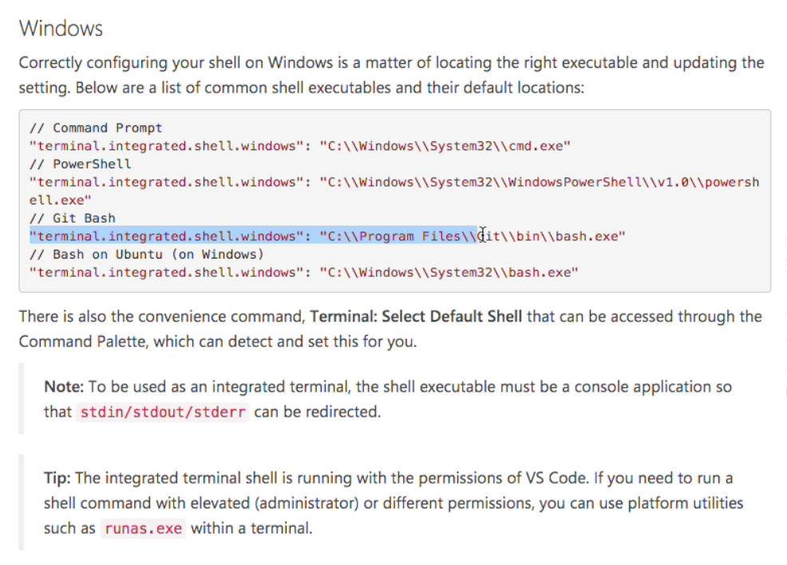

# Environment and Setup
* Node.Js
* VSCode Editor
* Postman --> HTTP Requests

## Chrome Extensions
* React DevTools
* Redux DevTools

## VSCode Extensions
* ES7 React/Redux/GraphQL/React-Native.snippets
* Prettier - Code Formatter --> Format on Save (search for in settings) --> search for prettier and can adjust settings
* in `settings.json` make sure to include language to auto create tags in JSX
```js
  "emmet.includeLanguages": {
    "ejs": "html",
    "javascript": "javascriptreact"
  },
```
* Use Git Bash for Windows --> copy and put in `settings.json` --> Linux Based Terminal

