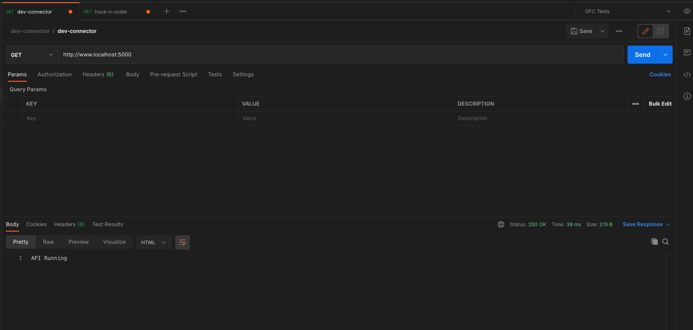
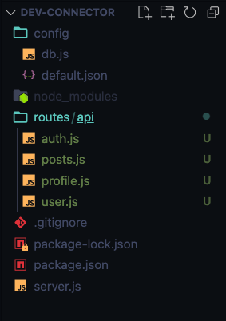
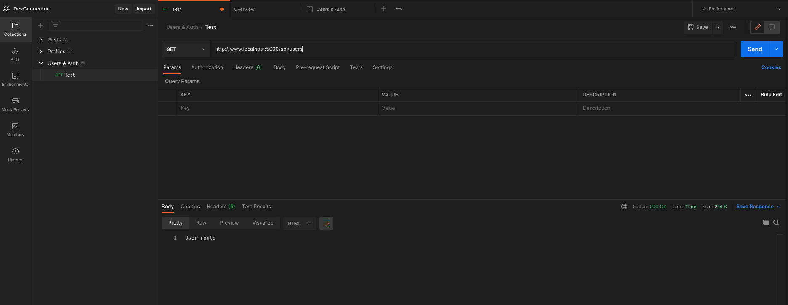

# Express & MongoDB Setup
 
* M - Mongo -> NoSQL DB, not a relational --> similar to JSON syntax or JS Objects
* E - Express
* R - React
* N - Node.Js

## MongoDB Atlas Setup
1. Create New Project
2. Create New Cluster
3. Security: Add User
4. Security: Whitelist IP Address
* Connect Database --> Connect to Application --> Gives you Connection String you'll be able to plug into Express App
* Use `mongoose` package to help us model our data and provides a bunch of methods to interact with our database

## Install Dependencies & Basic Express Setup
1. Create new project folder
2. add `.gitignore` file --> include `node_modules/` in file
3. `git init`
4. `npm init`
5. install dependencies --> `npm i express express-validator bcryptjs config gravatar jsonwebtoken mongoose request`
* **express**: main web framework for the backend
* **express-validator**: data validation for requests to our API
* **bcryptjs**: password encryptions
* **config**: for global variables
* **gravatar**: profile avatars --> use email associated with account to show profile image
* **jsonwebtoken**: pass along token for validation
* **mongoose**: layer that sits on top of the database so we can interact with it
* **request**: small module that will allow us to make HTTP requests to another API --> for our GitHub repos we'll add --> make request from backend so we can hide our API key and stuff like that and just return the repositories 
6. install dev dependencies --> `npm i -D nodemon concurrently`
* **nodemon**:  constantly watch our server so we don't have to refresh it every time we make a change (i have it installed globally)
* **concurrently**: allow us to run our backend express server and our front end dev server at the same time with one single command
7. create main entry files --> `server.js` --> set up basic express server
```js
const express = require('express');

const app = express();

app.get('/', (req, res) => res.send('API Running'));

const PORT = process.env.PORT || 5000;

app.listen(PORT, () => console.log(`Server started on port ${PORT}`));
```
8. add scripts to `package.json` --> start is for Heroku later, server is for us to run nodemon
```json
    "scripts": {
    "start": "node server",
    "server": "nodemon server"
  },
```
9. now use command in terminal `npm run server` to start up app
10. Use Postman to test connection

11. Commit progress to GitHub
* `git add .`
* `git commit -m 'Initial commit'`

## Connecting To MongoDB With Mongoose
1. Copy Connection String from Mongo Atlas --> need password and database name
* `mongodb+srv://rachel1789:<password>@devconnector.skfna.mongodb.net/myFirstDatabase?retryWrites=true&w=majority` 
2. create `config` folder --> create file,  `default.json` --> create global values we can use throughout our application with help of npm package we installed
```json
{
  "mongoURI": "mongodb+srv://rachel1789:<password>@devconnector.skfna.mongodb.net/test?retryWrites=true&w=majority"
}
```
3. could add connection logic in `server.js` but instead we are going to create new file in `config` --> `db.js` to create our mongoDB, mongoose connections
- require `mongoose` and `config`(want to grab the string we put in `default.json`)
```js
const mongoose = require('mongoose');
const config = require('config');
const db = config.get('mongoURI');

const connectDB = async () => {
  try {
    await mongoose.connect(db);

    console.log('MongoDB Connected');
  } catch (err) {
    console.error(err.message);
    // Exit process with failure
    process.exit(1);
  }
};

module.exports = connectDB;
```
4. In `server.js` --> bring in connectDB
```js
const express = require('express');
const connectDB = require('./config/db');

const app = express();

//Connect Database
connectDB();
```
5. We get a deprecation warning, so we will need to pass this option in our `mongoose.connect`
```js
const connectDB = async () => {
  try {
    await mongoose.connect(db, {
      useNewUrlParser: true,
      useUnifiedTopology: true,
    });
```

## Route Files With Express Router
* Create files that have routes that will pertain to our users
1. `mkdir routes`
2. `mkdir routes/api`
3. `touch routes/api/users.js routes/api/auth.js routes/api/profile.js routes/api/posts.js`

4. bring in express router to break it up --> example in `users.js`
```js
const express = require('express');
const router = express.Router();

// @route   GET api/users 
// @desc    Test route
// @access  Public
router.get('/', (req, res) => res.send('User route'));

module.exports = router;
```
5. in `server.js` make it so we can access routes --> app.use and then put in endpoint --> and want it to pertain to that users file (now api/users will pertain to the ('/') in file)
```js
// Define Routes
app.use('/api/users', require('./routes/api/users'))
```
* Keep our endpoints Restful, meaning that if we make a get request to the `api/users`, it would get those users
6. Create Collections in Postman for project to keep track and test our requests and endpoints

