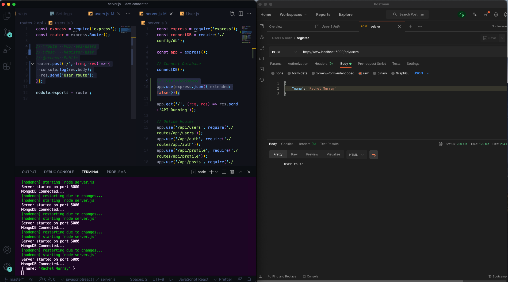
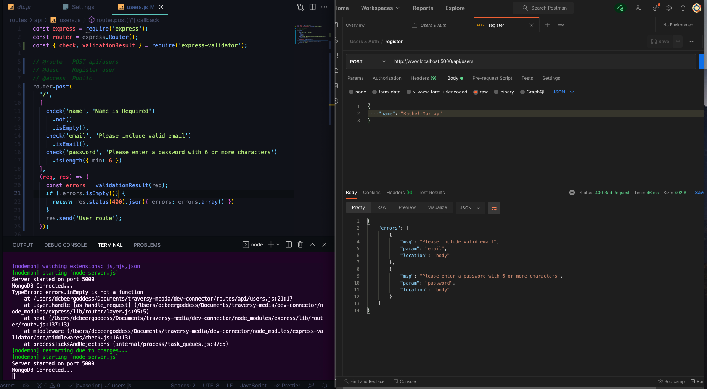
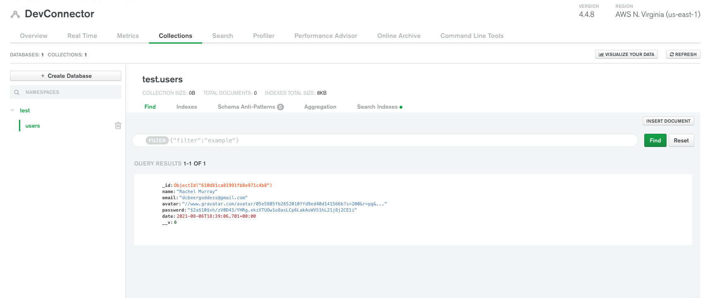
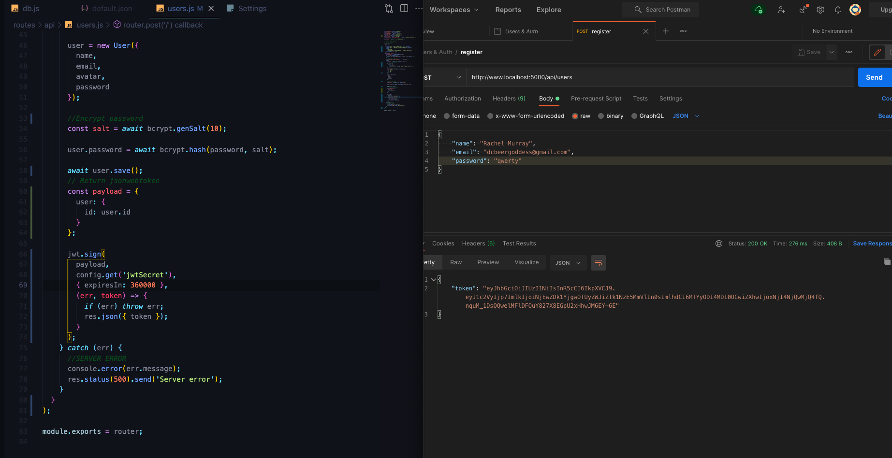
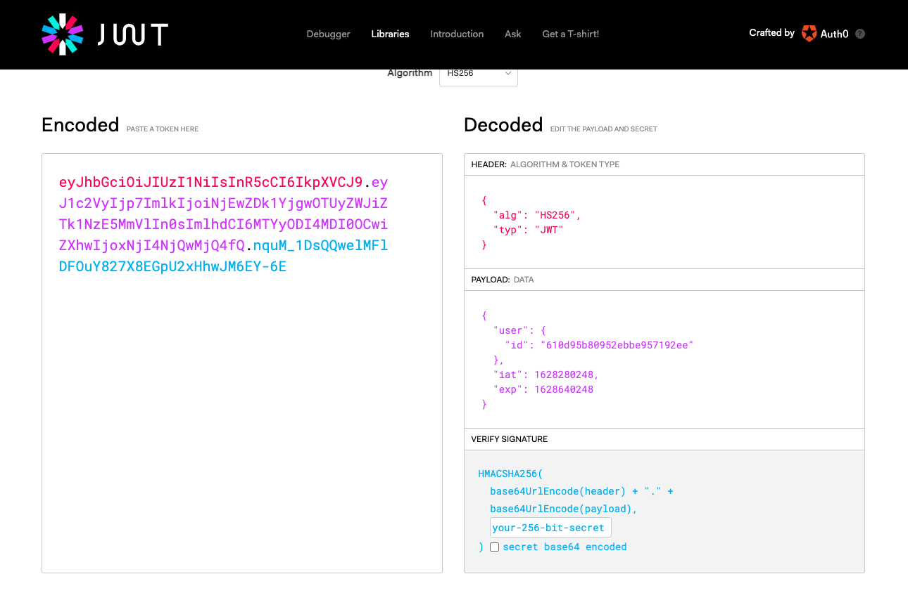
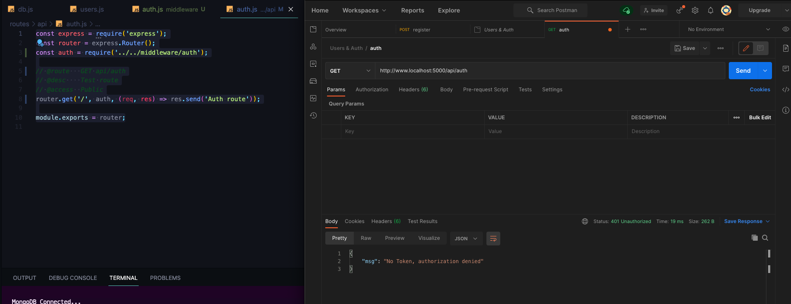
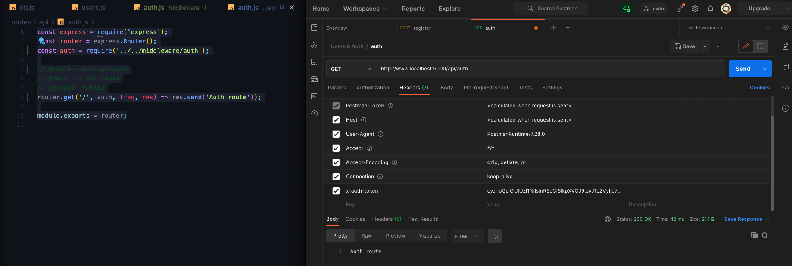
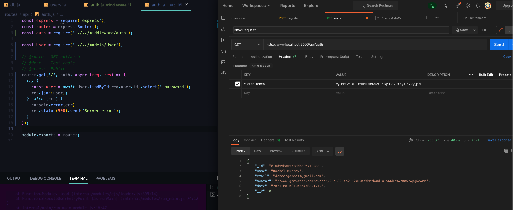
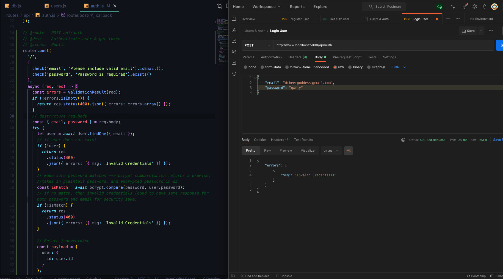
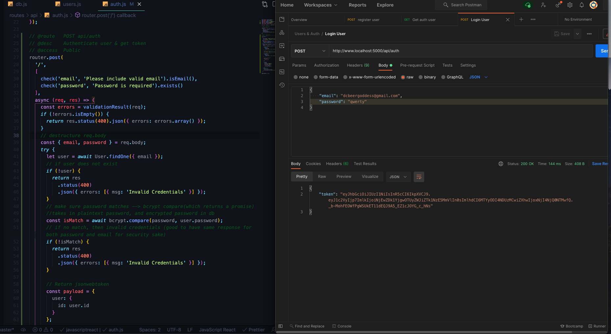

# User API Routes & JWT Authentication

* Start off with User Routes and Authentication and then move onto Profiles and Posts

## Creating the User Model
1. `mkdir models`
2. `touch models/User.js` (Uppercase is the convention for models)
3. Create `schema` for model --> holds the different fields that we want this particular resource to have
```js
const mongoose = require('mongoose');

const UserSchema = new mongoose.Schema({
  name: {
    type: String,
    required: true
  },
  email: {
    type: String,
    required: true,
    unique: true
  },
  password: {
    type: String,
    required: true
  },
  avatar: {
    type: String
  },
  date: {
    type: Date,
    default: Date.now
  }
});

module.exports = User = mongoose.model('user', UserSchema);
```

## Request & Body Validation
* Create Registration route --> we want to be able to send data to this route, we need to send a name in email and password in order to register user
1. Console log the `req.body` because that's the object of data that's going to be send to this route in `routes/api/users.js`
```js
// @route   POST api/users
// @desc    Register user
// @access  Public
router.post('/', (req, res) => {
  console.log(req.body);
  res.send('User route');
});

```
2. In order to make this work, and allow us to get the data in req.body we have to initialize the middleware for the body parser (used to have to install this as a separate package but now it's included in express) -- in `server.js`
```js
// Init Middleware
app.use(express.json({ extended: false }));
```
3. In `POSTMAN` we are going to make a post request with some `Headers` (make Content-Type: application/json)
* In `Body`, send `raw` data with just a name and we see it logged in the terminal

* we can send whatever data we want and access it with req.body
4. Before dealing with logic to deal with the database an register a user we need to handle validation and responses: `express-validator`
* in `routes/api/users.js` bring in `check` and `validationResult` from express-validator
* [Express Validator Docs](https://express-validator.github.io/docs/) 
* docs is using `body` instead of `check`, body --> just checks in the req.body instead (can do the same for ), check includes --> req.body, req.cookies, req.headers, req.params, req.query
* [Docs on Validation Middleware](https://express-validator.github.io/docs/check-api.html)
* pass in new parameter to route using check to set validators with a message
* in body, handle the response, set errors to validationResult with takes in the request
* if there are errors (errors in not empty) we want to return a status of 400 which is a bad request, if they don't include information correctly it is a bad request, we want to send back JSON and we can get these error messages and be visible in the response
```js
const { check, validationResult } = require('express-validator');

// @route   POST api/users
// @desc    Register user
// @access  Public
router.post(
  '/',
  [
    check('name', 'Name is Required')
      .not()
      .isEmpty(),
    check('email', 'Please include valid email')
      .isEmail(),
    check('password', 'Please enter a password with 6 or more characters')
      .isLength({ min: 6 })
  ],
  (req, res) => {
    const errors = validationResult(req);
    if (!errors.inEmpty()) {
      return res.status(400).json({ errors: errors.array() })
    }
    res.send('User route');
  });
  ```
  5. TEST IN POSTMAN
  
  * We'll be able to use this info in React on the Front End to display messages inside of an alert, etc --> also deals with empty strings which can be tricky with custom validation

## User Registration
* Start to work on register the user
1. See if user exists --> if user exists send back error
2. Get users gravatar 
3. Encrypt Password using bcrypt
4. Return jsonwebtoken  --> need token to be able to login after registration is sent
* destructure req.body, import User model, make function async, try and catch block to catch server errors
```js
    // destructure req.body
    const { name, email, password } = req.body;
    try {
      let user = await User.findOne({ email });
       // See if user exists
      if(user) {
        res.status(400).json({ errors: [ { msg: 'User already exists' } ] });
      }
```
* GRAVATAR, s=size, r=rating, d=default (don't want naked pics, d=mm just gives default icon)
```js
      //Get user gravatar
      const avatar = gravatar.url(email, {
        s: '200',
        r: 'pg',
        d: 'mm'
      })
```
* create new instance of user (we'll have to save user after we hash the password)
```js
        user = new User({
        name,
        email,
        avatar,
        password
      });
```
* Encrypt Passwords with bcryptjs, FIRST: create salt to do the hashing with, pass in rounds (10 is what is recommended), then take password and hash it (takes iin the plaintext password and then the salt) --> then save user --> returns promise so we need to await it (anything returning a promise needs to be awaited)
```js
      //Encrypt password 
      const salt = await bcrypt.genSalt(10);

      user.password = await bcrypt.hash(password, salt);

      await user.save()
```
* Now try it out in Postman with same data from before and check in MongoDB collections

* needed to return first res.status because it's not the last res.json, or res.status

## Implementing JWT
* [JWT](https://jwt.io/)
* [jsonwebtoken docs](https://github.com/auth0/node-jsonwebtoken#readme)
  - we have an algorithm, payload (data that you want to sen within the token), issue = timestamp, and then signature (in our case is the `id`)
1. Protect our routes by creating a piece of middleware that will verify the token
    - we can call jwt.verify with the token that is sent in and it's going to get sent in through the HTTP headers and we can verify it and then either allow the user to access if it verifies or send back a response that says token is invalid
    - bring jsonwebtoken in to users route file
    - bring in config/default.json with added secret token to pass in
    - after token we can put in options (i.e. expires, etc.) --> we want to set it to 1 hour in production for for testing keep it longer
    - after that you want to put a callback that takes in two things, possible error and token, if we don't get an error we will send that token back to the client
      ```js
            await user.save();
            // Return jsonwebtoken
            const payload = {
              user: {
                id: user.id
              }
            };

            jwt.sign(
              payload,
              config.get('jwtSecret'),
              { expiresIn: 360000 },
              (err, token) => {
                if (err) throw err;
                res.json({ token });
              }
            );
      ```
    - Delete Collection in Mongo and save user again in Postman
    - Returns token
     
    - have not set up functionality for token but we will be able to take this and send it in the headers and access protected routes
* Take token and paste it into jwt.io --> gives back information, like id (from Mongo), initiated at date/time and expiration


## Custom Auth Middleware & JWT Verify
* need to make sure we can send token back and authenticate and access protected routes
* create our own middleware, create folder in root called middleware (before he used passport but it's heavy and you don't really need it unless your trying to implement Facebook login, or stuff like that) --> create file `auth.js`
    - Export middleware function, needs to take in req, res, and next --> function that has access to the request and response cycle/objects --> next is actually a callback that we have to run once we're done so it moves on the the next piece of middleware 
    - create variable called `token` adn we can get it with `req.header` and the `header` we want to get is `x-auth-token`
    - check if there is no token and send 401 code (Not Authorized)
    - if there is a token, inside try and catch block, create a variable called `decoded` and we need to basically decode that token and we can do that with `jwt.verify` --> takes in two things, the actual `token` being sent in the header and the `secret` (decodes token)
    - take req object and assign a value to user and set that value to the decoded value (we get from the id in the payload) 
    - then we call next
        ```js
        const jwt = require('jsonwebtoken');
        const config = require('config');

        module.exports = function (req, res, next) {
          // Get token from header
          const token = req.header('x-auth-token');

          //Check if no token
          if (!token) {
            return res.status(401).json({ msg: 'No Token, authorization denied' });
          }

          //Verify Token if there is one
          try {
            const decoded = jwt.verify(token, config.get('jwtSecret'));

            req.user = decoded.user;
            next();
          } catch (err) {
            res.status(401).json({ msg: 'Token is not valid' });
          }
        };
        ```
* Now Implement into protected route
    - lets put this in our `auth.js` route
    - bring it in as a parameter to our route
      ```js
      const express = require('express');
      const router = express.Router();
      const auth = require('../../middleware/auth');

      // @route   GET api/auth
      // @desc    Test route
      // @access  Public
      router.get('/', auth, (req, res) => res.send('Auth route'));

      module.exports = router;
      ```
    - Test in Postman
    
    - Take token and add key in headers
    
    - instead of res.send we are going to make a call to our database (try and catch block), async & await,
    - find user by id and since this is a protected route we use the token which has the id in our middleware and set `req.user.id`
    - do not want to return the password so we can use `select` and leave off the password in the data
    - and then res.json and send along the user
    - error = 500 status
        ```js
        router.get('/', auth, async (req, res) => {
          try {
            const user = await User.findById(req.user.id).select('-password');
            res.json(user);
          } catch (err) {
            console.error(err);
            res.status(500).send('Server error');
          }
        });
        ```
    - Now in Postman we get back all our user data
    
    - for React application, going to constantly make a request with the token and fill our Redux State(our application state) whch is going to have a user value with our user object with this stuff in it
    - now we can verify the jsonwebtoken that comes in from the client and basically authenticate our users

## User Authentication/Login Route
* Be able to log in with users already in the database
* will got in our routes `api/auth.js` because it's authentication -- similar to register, except instead of signing up a user, we are validating a user
```js
// @route   POST api/auth
// @desc    Authenticate user & get token
// @access  Public
router.post(
  '/',
  [
    check('email', 'Please include valid email').isEmail(),
    check('password', 'Password is required').exists()
  ],
  async (req, res) => {
    const errors = validationResult(req);
    if (!errors.isEmpty()) {
      return res.status(400).json({ errors: errors.array() });
    }
    // destructure req.body
    const { email, password } = req.body;
    try {
      let user = await User.findOne({ email });
      // if user does not exist
      if (!user) {
        return res
          .status(400)
          .json({ errors: [{ msg: 'Invalid Credentials' }] });
      }
      // make sure password matches --> bcrypt compare(which returns a promise)
      //takes in plaintext password, and encrypted password in db
      const isMatch = await bcrypt.compare(password, user.password);
      // if no match, then invalid credentials (good to have same response for both password and email for security sake)
      if (!isMatch) {
        return res
          .status(400)
          .json({ errors: [{ msg: 'Invalid Credentials' }] });
      }

      // Return jsonwebtoken
      const payload = {
        user: {
          id: user.id
        }
      };

      jwt.sign(
        payload,
        config.get('jwtSecret'),
        { expiresIn: 360000 },
        (err, token) => {
          if (err) throw err;
          res.json({ token });
        }
      );
    } catch (err) {
      //SERVER ERROR
      console.error(err.message);
      res.status(500).send('Server error');
    }
  }
);
```
* Go Back to Postman and make post request to api/auth (add Content-Type: application/json) to the Headers
    - Invalid Credentials working
    
    - getting token back with login info correct
    
    - Created new user and tested token and all is working `:)`


