# Profile API Routes

## Creating The Profile Model
* Create Profile Model File
    - create ref to user model
    ```js
      const ProfileSchema = new mongoose.Schema({
        user: {
          type: mongoose.Schema.Types.ObjectId,
          ref: 'user'
        }
      });
    ```
    - Add in fields from Brad's repo in github --> many fields but pretty straight forward
* Now we can bring profile model into our profile routes and query teh database --> get profiles, create them, update, and delete

## Get Current User Profile
* create route to fetch our own profile
```js
// @route   GET api/profile/me
// @desc    Get current users profile
// @access  Private
router.get('/me', auth, async (req, res) => {
  try {
    // find user by user ref id and populate the name and avatar
    const profile = await Profile.findOne({ user: req.user.id }).populate(
      'user',
      ['name', 'avatar']
    );
    //if no profile then send error
    if (!profile) {
      return res.status(400).json({ msg: 'There is no profile for this user' });
    }
    //if profile exists --> send it along
    res.json(profile);
  } catch (err) {
    console.error(err.msg);
    res.status(500).send('Server Error');
  }
});
```
* IN POSTMAN Try with our token --> error because we have no profile
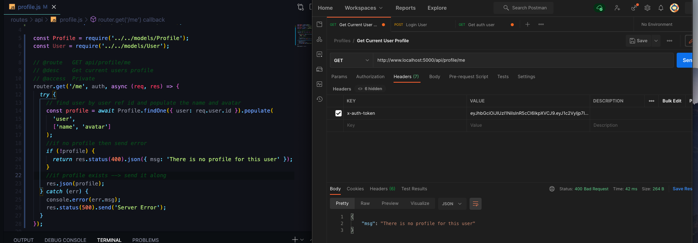

## Create & Update Profile Routes
* Route to create or update profile --> probably our longest route --> bring in express validator to routes file
    - POST request that takes in data
    - want ot bring in express validator stuff
    - need auth middleware and check for required items in model
    - create errors variable to check if req passes validation
    - if there are errors array we will throw client error and send JSON which will be an object with an errors array that we get from errors
        ```js
        // @route   POST api/profile/
        // @desc    Create or Update user profile
        // @access  Private
        router.post(
          '/',
          [
            auth,
            [
              check('status', 'Status is required').not().isEmpty(),
              check('skills', 'Skills is required').not().isEmpty()
            ]
          ],
          async (req, res) => {
            const errors = validationResult(req);
            if (!errors.isEmpty()) {
              return res.status(400).json({ errors: errors.array() });
            }
          }
        );
        ```
    - Test Validation in POSTMAN -> add content-type and token in Headers (save token and content-type as a Preset to quickly add in future)
    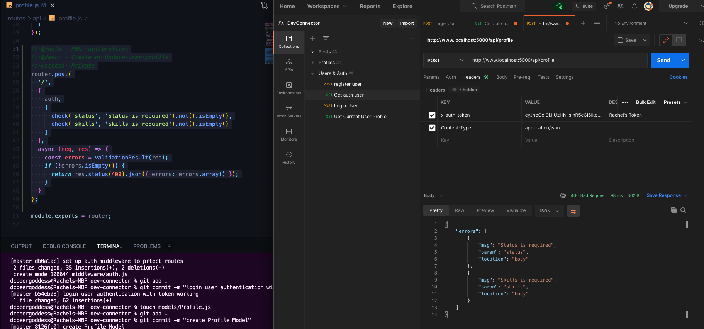
    - Add in Status and Skills --> it's passing but we haven't told it to send anything back yet
    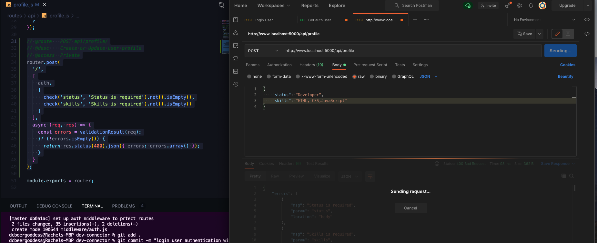
* Pull out all fields from req.body
    - check to make sure that fields were added before we try to submit to database
    - build a profile object --> initialize profile fields to an empty object --> go one by one and add each field
    - we can get the user from req.user.id (knows that from token that is sent)
    - add all fields (expect social) --> need to make skills into array (right now this is going to be a comma separated list), take skills and `.split()` --> turns a string into an array --> it takes in a delimiter which is going to be the comma, want it to not matter if there's a space or even 10 space, --> map through array (chain on map method) --> and for each skill go ahead and trim it
    ```js
      // DESTRUCTURE ALL THE FIELDS WE WANT TO PULL OUT from req.body
          const {
            company,
            website,
            location,
            bio,
            status,
            githubusername,
            skills,
            youtube,
            facebook,
            twitter,
            instagram,
            linkedin
          } = req.body;
          // BUILD PROFILE OBJECTS
          const profileFields = {};
          // get from token
          profileFields.user = req.user.id;
          if (company) profileFields.company = company;
          if (website) profileFields.website = website;
          if (location) profileFields.location = location;
          if (bio) profileFields.bio = bio;
          if (status) profileFields.status = status;
          if (githubusername) profileFields.githubusername = githubusername;
          if (skills) {
            profileFields.skills = skills.split(',').map(skill => skill.trim());
          }

          console.log(profileFields.skills);
          res.send('Hello');
    ```
    - TEST IN POSTMAN
    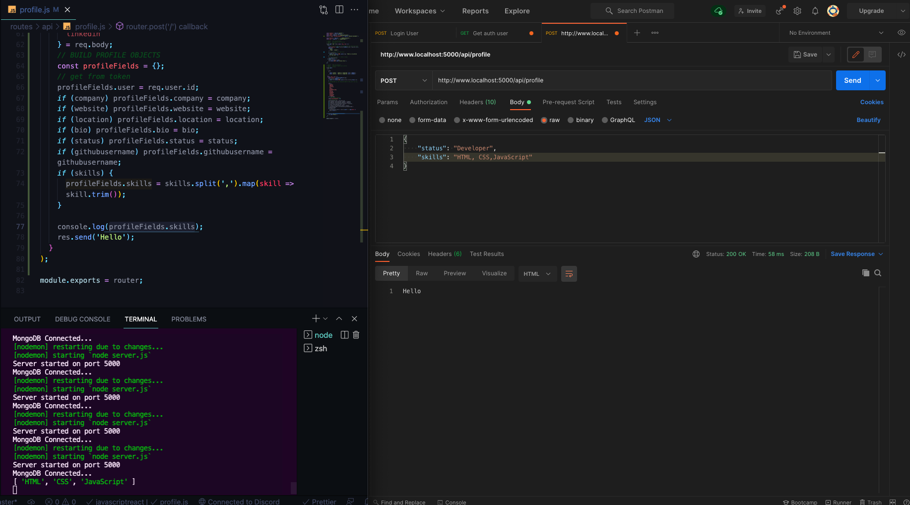
* Add in social fields --> 
    - we have to initialize --> set `profileFields.social` to an empty object (otherwise it's throw an error that it would be able to find anything we set to profileFields.social because social is undefined) 
        ```js
            // Build social object
            profileFields.social = {};
            if (youtube) profileFields.social.youtube = youtube;
            if (twitter) profileFields.social.twitter = twitter;
            if (facebook) profileFields.social.facebook = facebook;
            if (linkedin) profileFields.social.linkedin = linkedin;
            if (instagram) profileFields.social.instagram = instagram;

        ```
* now that we have all these properties inside of profileFields we are ready to actually update and insert the data
    - try and catch block
    - take profile model and find one by user (remember that user field is the object id and we can match that to req.user.id which comes from the token)
    - if there is a profile then that means we want to update it
    - anytime a mongoose method is used it returns a promise so we need to await it
    - find one by user and update it, and then set profile fields, and also add another parameter object with new and set that to true
    - we want to return the entire profile --> THIS IS FOR IF THERE IS A PROFILE
    - If there is no profile then we will want to create it and set it to a new profile, pass in profile fields, and then we need to save it, and then we want to return the profile
      ```js
          try {
            let profile = await Profile.findOne({ user: req.user.id });

            if (profile) {
              //UPDATE
              profile = await Profile.findOneAndUpdate(
                { user: req.user.id },
                { $set: profileFields },
                { new: true }
              );

              return res.json(profile);
            }
            // Create Profile (if does not exist yet)
            profile = new Profile(profileFields);

            await profile.save();
            res.json(profile);
          } catch (err) {
            console.error(err);
            res.status(500).send('Server Error');
          }
      ```
* TEST IN POSTMAN
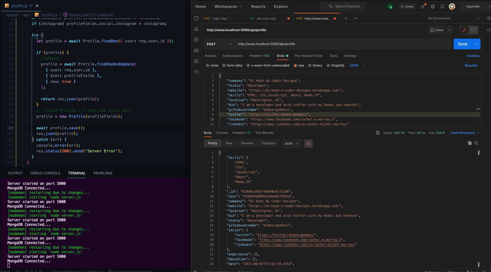
- experience and education will initialize as empty arrays, we will have endpoints to create those later 

## Get All Profiles & Profile By User ID
* create more routes to get all profiles and get a profile by the user id
* Fix Deprecation Warning of findAndModify in `db.js` --> set useFindAndModify to false
* Create Route to get All Profiles
    - use find message, but we also want to populate the name and avatar as an array of fields from the user collection
    - then res.json those profiles along
    ```js
    // @route   GET api/profile/
    // @desc    Get all profiles
    // @access  Public
    router.get('/', async (req, res) => {
      try {
        const profiles = await Profile.find().populate('user', ['name', 'avatar']);
        res.json(profiles);
      } catch (err) {
        console.error(error.msg);
        res.status(500).res.send('Server Error');
      }
    });
    ```
    - TEST IN POSTMAN --> gives back array of objects (only one right now) --> adds user with name and avatar
    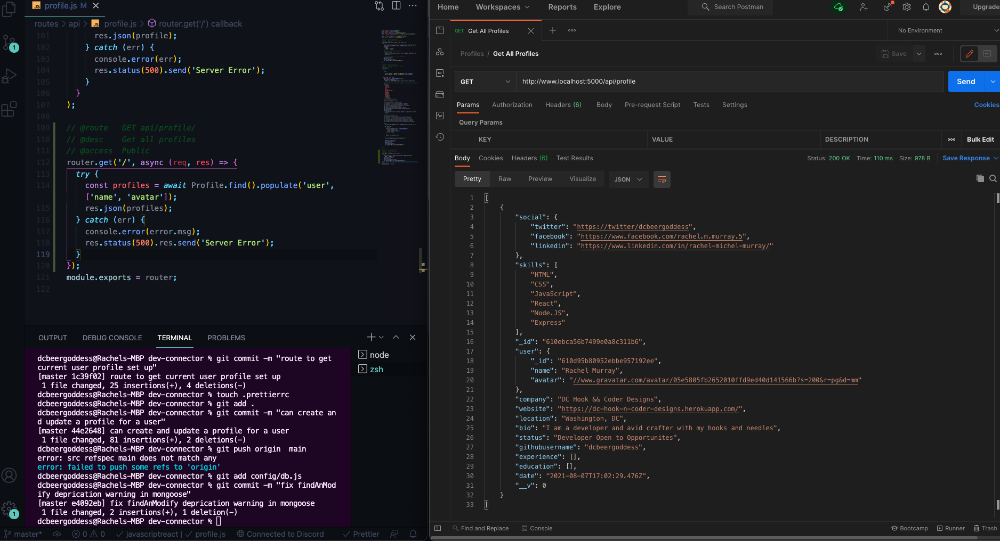
    - Create Profile for John Doe and send get request again to get all profiles, now we have two objects in our array with both users profiles
* GET PROFILES by USER ID
    - GET api/profile/user/:user_id
    - as far as the query, take 's' off profiles because we are getting just one
    - instead of find, we use fineOne and we want to find it by the user, and the id is going to come from URL and we can access with `req.params.user_id`
    - check if there is a profile for user, if not we return 400 error code and send some JSON with a message
    - otherwise go ahead and send the profile
        ```js
        // @route   GET api/profile/user/:user_id
        // @desc    Get profile by user ID
        // @access  Public
        router.get('/user/:user_id', async (req, res) => {
          try {
            const profile = await Profile.find({ user: req.params.user_id }).populate(
              'user',
              ['name', 'avatar']
            );

            if (!profile)
              return res.status(400).json({ msg: 'There is no profile for this user' });
            res.json(profile);
          } catch (err) {
            console.error(error.msg);
            res.status(500).res.send('Server Error');
          }
        });
        ```
      - TEST IN POSTMAN --> grab a user Object ID to test
      
      - we do have one issue that if you pass in an invalid Object ID it will return a server error instead of 'there is no profile for this user'
      - we can throw error for specific error messages based on ObjectId
        ```js
        // @route   GET api/profile/user/:user_id
        // @desc    Get profile by user ID
        // @access  Public
        router.get('/user/:user_id', async (req, res) => {
          try {
            const profile = await Profile.find({ user: req.params.user_id }).populate(
              'user',
              ['name', 'avatar']
            );

            if (!profile) return res.status(400).json({ msg: 'Profile not found' });
            res.json(profile);
          } catch (err) {
            console.error(err.msg);
            if (err.kind === 'ObjectId') {
              return res.status(400).json({ msg: 'Profile not found' });
            }
            res.status(500).res.send('Server Error');
          }
        });
        ```

## Delete Profile & User
* Delete not just a profile but a user completely including posts
    - we are not getting anythings so we don't need to save it to a variable
    - use method `findOneAndRemove`
    - pass in user which is the objectId and match that to req.user.id --> private which means we have access to the token and we need to add `auth` as parameter
    - we want to come back a remove posts later
    - for user, we're dealing with user model and now instead of user since that's not a field in the user model, we want to use underscore id 
    - send message that user was removed or deleted
      ```js
      // @route   DELETE api/profile/
      // @desc    Delete profile, user & posts
      // @access  Private
      router.delete('/', auth, async (req, res) => {
        try {
          // @todo - remove users posts

          // Remove profile
          await Profile.findOneAndRemove({ user: req.user.id });
          // Remove User
          await User.findOneAndRemove({ _id: req.user.id });

          res.json({ msg: 'User deleted' });
        } catch (err) {
          console.error(err.msg);
          res.status(500).res.send('Server Error');
        }
      });
      ```
  * Create new user with profile in POSTMAN and test DELETE, User removed from MongoDB Collections
  

## Add Profile Experience
* We have create and update route, but that's just to update the main data, experience and education are basically like separate resources
* We are going to make a put request which is used to update data
* it's an array within a collection with a document (could make it a post request) but basically we are updated PART of a profile
    - create put route for experience
    - we are going to need some validation here because on the front end in react, we're going to have a form to add an experience and title, company and from data are all going to be required --> add brackets around middleware parameters 
        ```js
          router.put(
          '/experience',
          [
            auth,
            [
              check('title', 'Title is required').not().isEmpty(),
              check('company', 'Company is required').not().isEmpty(),
              check('from', 'From date is required').not().isEmpty()
            ]
          ],
          async (req, res) => {
            const errors = validationResult(req);
            if (!errors.isEmpty()) {
              return res.status(400).json({ errors: errors.array() });
            }
        ```
* Now destructure and pull out some stuff from request body
    - create a new object and save to new experience variable that will contain the data the user submits
      ```js
          // destructure from req.body
          const { title, company, location, from, to, current, description } =
            req.body;
          // create new Experience object with the data that the user submits
          const newExp = {
            // title: title (below is shorthand of this)
            title,
            company,
            location,
            from,
            to,
            current,
            description
          };
      ```
* Now we want deal with MongoDB
    - create variable called `profile` to fetch the profile we want to add experience to
    - find by user (have `user` field that can match to `req.user.id` that we get from token `auth`)
    - take `profile.experience` (which is an array) and we can push on to it
    - we are going to use `unshift`, which is same as push, BUT pushed onto the BEGINNING OF ARRAY rather than the end so our most recent experience is our first, and pass in the `newExp`
    - await profile save
    - return entire profile, this will help us in the front end later on
      ```js
          // Fetch Profile to add the experience to
          try {
            const profile = await Profile.findOne({ user: req.user.id });

            profile.experience.unshift(newExp);

            await profile.save();

            res.json(profile);
          } catch (err) {
            console.error(err.message);
            res.status(500).send('Server Error');
          }
        }
      ```
    - TEST IN POSTMAN
        - sending data so use content type header, login as rachel user and get token, and pass into HEADERS
        - add data as raw json in BODY
        - for date we can enter Month, day, year for now. In front in we'll use moment.js to make it look nice, not going to add a to date, but will set current to true since it's a current job/role
        - Experience added as object in the array, and it also comes with it's own ID with is what's great about using a document database/NoSQL database
    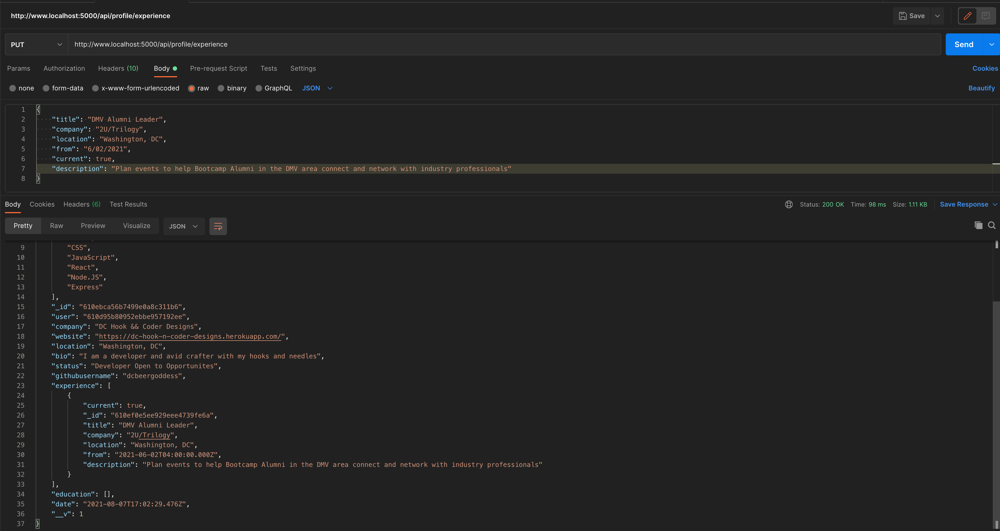
* We're not going to add functionality to update but can do that on own if we want

## Delete Profile Experience
* add some more experiences to user profile using postman
* in order to delete one, we're going to need to add that id in experience object to our request 
* it would be possible to use a PUT request since we are updating, but since something is actually being removed, delete request is the preference
    - get the profile by our user id
    - then we need to get the correct experience to remove - GET REMOVE INDEX
    - create removeIndex variable to map over experience array and pass in item and return just the id
    - chain on indexOf and we want to get the one to match it to the `req.params.exp_id`, match whatever this is and get the experience
    - take `profile.experience` and splice because we want to take something out and we already have the index available to use in removeIndex and take that one out
    - await the new profile save
    - send back response 
      ```js
        // @route   DELETE api/profile/experience/:exp_id
        // @desc    Delete experience from profile
        // @access  Private
        router.delete('/experience/:exp_id', auth, async (req, res) => {
          try {
            const profile = await Profile.findOne({ user: req.user.id });
            // Get remove index
            const removeIndex = profile.experience
              .map(item => item.id)
              .indexOf(req.params.exp_id);
            // removed item based on index that matched
            profile.experience.splice(removeIndex, 1);
            // await save
            await profile.save();
            // and send back response
            res.json(profile);
          } catch (err) {
            console.error(err.message);
            res.status(500).send('Server Error');
          }
        });
      ```

    - TEST IN POSTMAN --> grab ID of experience you want to delete and add to route, add your token to headers
    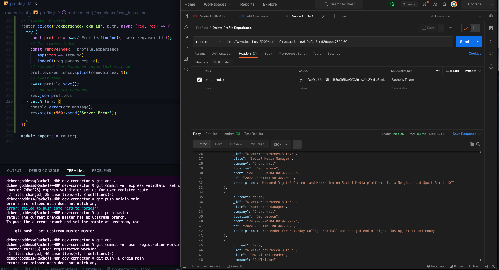

## Add & Delete Profile Education
* Do same thing for Education that we did for experience, copy PUT and DELETE Route and change what is needed in education
```js
  // @route   PUT api/profile/education
// @desc    Add profile education
// @access  Private
router.put(
  '/education',
  [
    auth,
    [
      check('school', 'School is required').not().isEmpty(),
      check('degree', 'Degree is required').not().isEmpty(),
      check('fieldofstudy', 'Field of Study is required').not().isEmpty(),
      check('from', 'From date is required').not().isEmpty()
    ]
  ],
  async (req, res) => {
    const errors = validationResult(req);
    if (!errors.isEmpty()) {
      return res.status(400).json({ errors: errors.array() });
    }
    // destructure from req.body
    const { school, degree, fieldofstudy, from, to, current, description } =
      req.body;
    // create new Experience object with the data that the user submits
    const newEdu = {
      // title: title (below is shorthand of this)
      school,
      degree,
      fieldofstudy,
      from,
      to,
      current,
      description
    };
    // Fetch Profile to add the experience to
    try {
      const profile = await Profile.findOne({ user: req.user.id });

      profile.education.unshift(newEdu);

      await profile.save();

      res.json(profile);
    } catch (err) {
      console.error(err.message);
      res.status(500).send('Server Error');
    }
  }
);

// @route   DELETE api/profile/education/:edu_id
// @desc    Delete education from profile
// @access  Private
router.delete('/education/:edu_id', auth, async (req, res) => {
  try {
    const profile = await Profile.findOne({ user: req.user.id });
    // Get remove index
    const removeIndex = profile.education
      .map(item => item.id)
      .indexOf(req.params.edu_id);
    // removed item based on index that matched
    profile.education.splice(removeIndex, 1);
    // await save
    await profile.save();
    // and send back response
    res.json(profile);
  } catch (err) {
    console.error(err.message);
    res.status(500).send('Server Error');
  }
});
```
- TEST IN POSTMAN
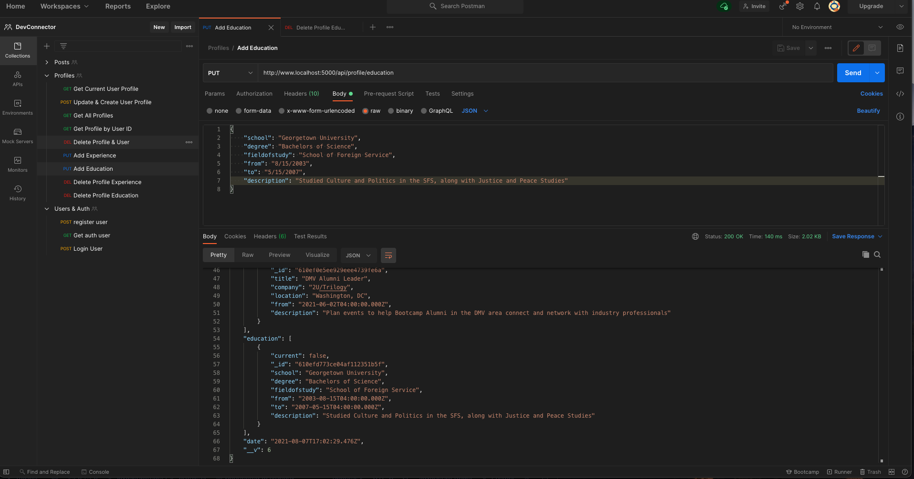
- grab id of dummy education and delete
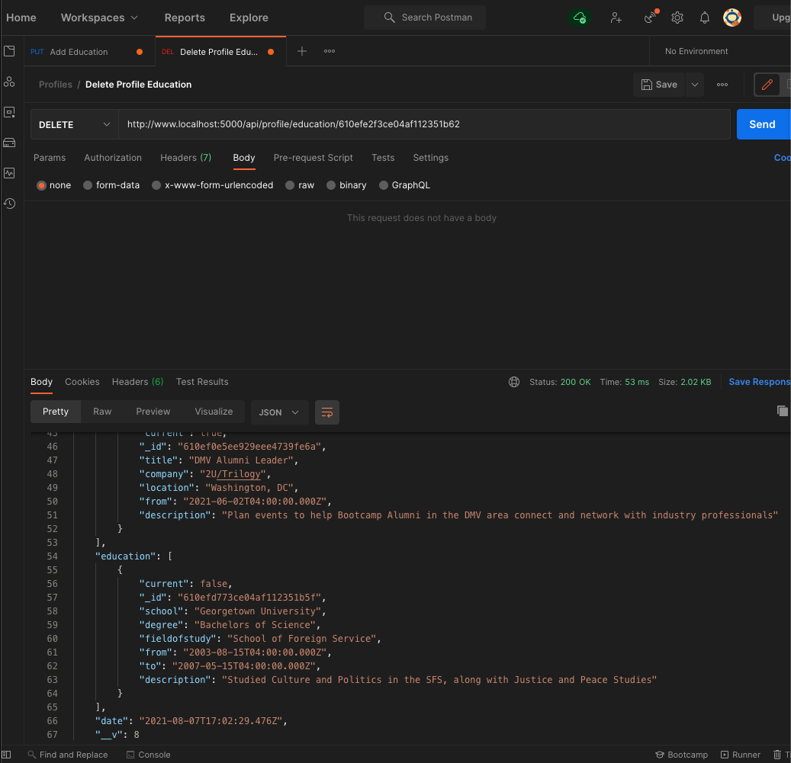

## Get Github Repos For Profile
* last version brad put the github logic on the client side which is bad practice since you have your API KEY on the front end which people can find and use it if they want
* make request from our backend rather than react and only return the repositories
* go to [Git Hub Developer Settings](https://github.com/settings/developers) to OAuth the application and use localhost as your URL, otherwise you can only make like 50 requests per hour
* Grab Client ID and Secret that is generated and we are going to add them it too default.json in our config
* GO BACK TO Profile Route file & Create new route
    - to /github/:username to get user repos from GitHub, will be public because viewing a profile is public
    - want to be able to show the repositories there
    - construct options object that has a URI and plug this into `request` which is the npm package we installed so we need to bring that into the file along with our config for the client id and secret
    - URI --> github api docs (add in parameters on repos, amount per page, sorted by created date ascending, and add client id and secret)
    - specify method of get
    - add to headers to avoid issues brad was having (user-agent)
        ```js
        // @route   GET api/profile/github/:username
        // @desc    Get user repos from GitHub
        // @access  Public
        router.get('/github/:username', (req, res) => {
          try {
            const options = {
              uri: `https://api.github.com/users/${req.params.username}/repos?per_page=5&sort=created:asc&client_id=${config.get('githubClientId')}&client_secret=${config.get('githubSecret')}`,
              method: 'GET',
              headers: { 'user-agent': 'node.js'}
            }
        ```
    - then we do request that takes in our options and then a callback which will give us a possible error, a response object and body
    - add arrow function and go ahead and check for error, if there is then console that error
    - we want to check if is a 200, if it's not then we send back a 404 error and just say the profile isn't found and send response with JSON and send back the `body` (The `body` is basically going ot be a regular `string` with escaped quotes so we want to `JSON.parse` and have our data sent back as like that)
    - need to remember to return res.status(404)... since it's not the last response being sent back, otherwise error in terminal
        ```js
          request(options, (error, response, body) => {
            if (error) console.error(error);

            if (response.statusCode !== 200) {
              return res.status(404).json({ msg: 'No GitHub profile found' });
            }

            res.json(JSON.parse(body));
          });
        ```
    - TEST IN POSTMAN --> we get back latest 5 created repos in our username ascending
    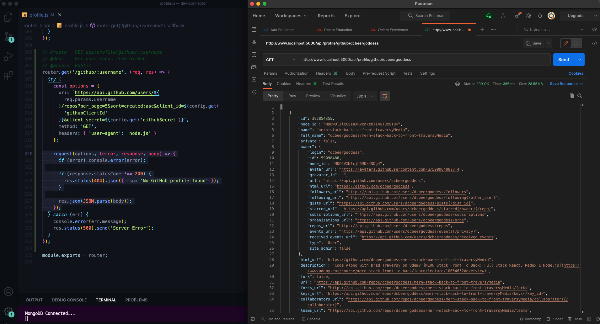
    -


