# Post API Routes

## Creating The Post Model
* Create Model in models folder
* create variable called Schema so you don't have to type mongoose.Schema later on
* posts are connected to user --> can make is so user can only delete their own posts and stuff like that
* add in name and avatar, this relates to user and doing that because we will want to have the option to not delete posts if you don't want to, say a user deletes account want to be able to keep the post, also want to be able to easily add avatar into post without having to dig into user collection
* system to like and remove your like --> create array of likes, and in array have the user ref as well (now we now what likes came from what user) --> it will basically be an array of user IDs
* similar for comments --> add text, etc for post --> along with name and avatar like we did with Post --> add date to comments
* add date to posts as well
    ```js
    const mongoose = require('mongoose');
    const Schema = mongoose.Schema;

    const PostSchema = new Schema({
      user: {
        type: Schema.Types.ObjectId,
        ref: 'users'
      },
      text: {
        type: String,
        required: true
      },
      name: {
        type: String
      },
      avatar: {
        type: String
      },
      likes: [
        {
          user: {
            type: Schema.Types.ObjectId,
            ref: 'users'
          }
        }
      ],
      comments: [
        {
          user: {
            type: Schema.Types.ObjectId,
            ref: 'users'
          },
          text: {
            type: String,
            required: true
          },
          name: {
            type: String
          },
          avatar: {
            type: String
          },
          date: {
            type: Date,
            default: Date.Now
          }
        }
      ],
      date: {
        type: Date,
        default: Date.Now
      }
    });

    module.exports = Post = mongoose.model('post', 'PostSchema');
    ```

## Add Post Route
* Go to posts.js route file -- create post -- private (need to be logged in)
* auth middleware, express validator, etc.
```js
const express = require('express');
const router = express.Router();
const { check, validationResult } = require('express-validator');
const auth = require('../../middleware/auth');

const Post = require('../../models/Post');
const Profile = require('../../models/Profile');
const User = require('../../models/User');

// @route   POST api/posts
// @desc    Create a post
// @access  Private
router.get(
  '/',
  [auth, [check('text', 'Text is required').not().isEmpty()]],
  async (req, res) => {
    const errors = validationResult(req);
    if (!errors.isEmpty()) {
      return res.status(400).json({ errors: errors.array() });
    }
    try {
      // GRAB User info, using token, exclude password
      const user = await User.findById(req.user.id).select('-password');
      // name and avatar coming from user find
      const newPost = {
        text: req.body.text,
        name: user.name,
        avatar: user.avatar,
        user: req.user.id
      };

      const post = await newPost.save();

      res.json(post);
    } catch (err) {
      console.log(err.message);
      res.status(500).send('Server Error');
    }
  }
);

module.exports = router;
```
* TEST IN POSTMAN to see if error works with no text being sent
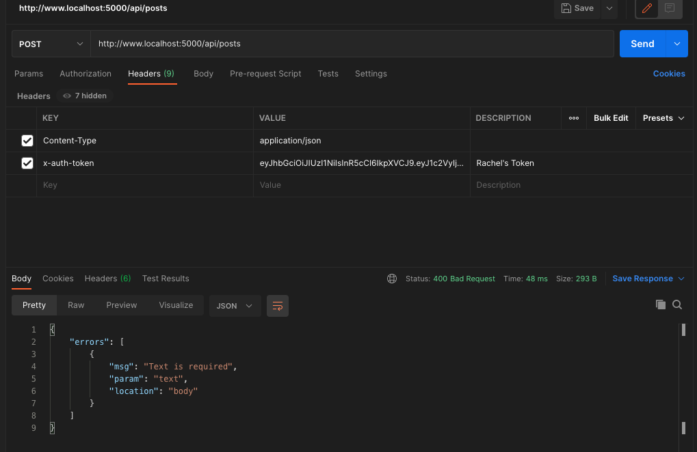
* now text with Text being sent --> actually got server error because at first we did not `instantiate a new post when we created nePost object`
* `const newPost = new Post({`
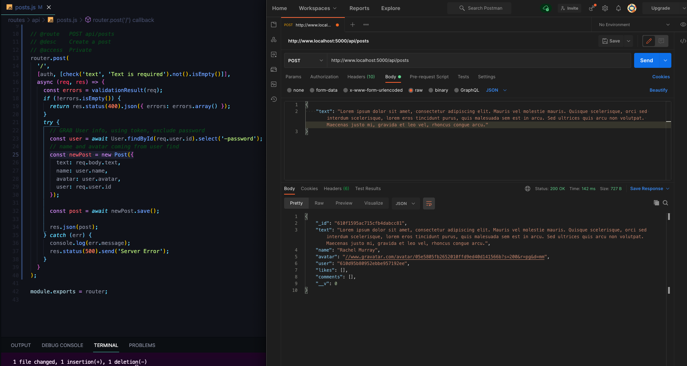
* post with a different user now so we have multiple posts

## Get & Delete Post Routes
### GET ALL POSTS
* Create Get All Posts Route (private for now, can make public if you wanted), but we are building the front end so you would have to be logged in to even see the post, profiles are public but not posts --> main reason is to get people to sign up to communicate with other developers 
* find all posts and sort by date (-1) = most recent post first (oldest first is 1 and is also the default)
```js
// @route   GET api/posts
// @desc    Get all posts
// @access  Private
route.get('/', auth, async (req, res) => {
  try {
    const posts = await Post.find().sort({ date: -1 });
    res.json(posts);
  } catch (err) {
    console.log(err.message);
    res.status(500).send('Server Error');
  }
});
```
* Try in POSTMAN --> need token
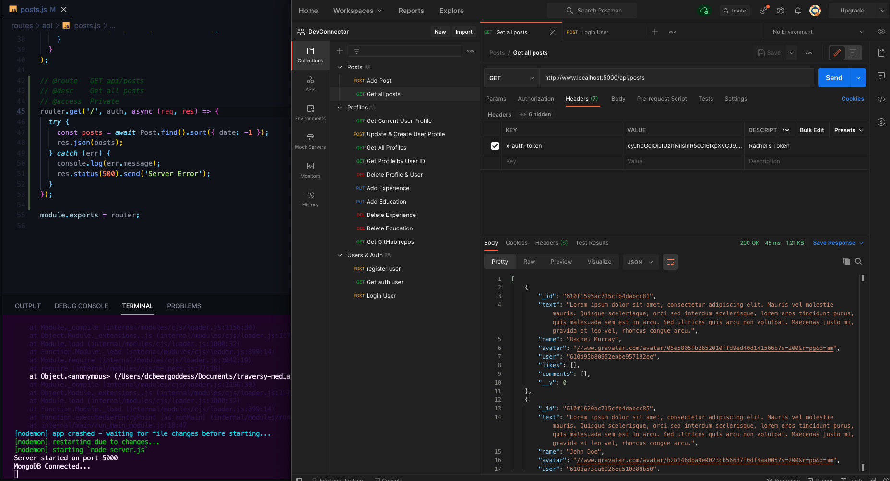
### GET SINGLE POST BY ID
* copy get all, and find by id instead for route and mongoose query
* need to check if there is a post with that id before we send the post back --> also have same issue as profile if they pass in something that is not a valid ObjectId
```js
// @route   GET api/posts/:id
// @desc    Get post by id
// @access  Private
router.get('/:id', auth, async (req, res) => {
  try {
    const post = await Post.findById(req.params.id);

    if (!post) {
      return res.status(404).json({ msg: 'Post not found' });
    }

    res.json(post);
  } catch (err) {
    console.log(err.message);
    if (err.kind === 'ObjectId') {
      return res.status(404).json({ msg: 'Post not found' });
    }
    res.status(500).send('Server Error');
  }
});
```
* TEST IN POSTMAN
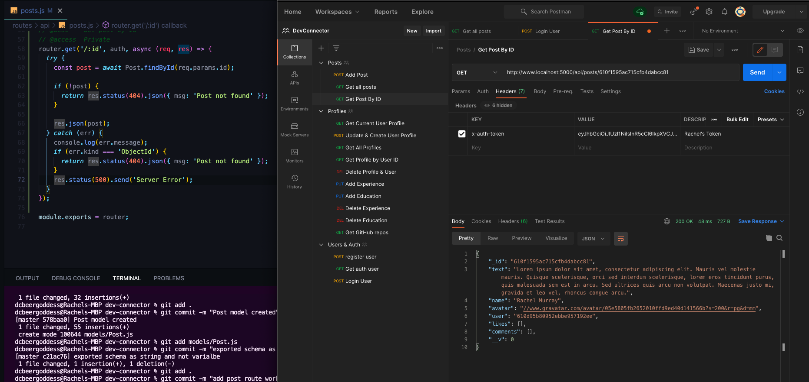
### DELETE POST BY ID
```js
// @route   DELETE api/posts/:id
// @desc    Delete a post
// @access  Private
router.get('/:id', auth, async (req, res) => {
  try {
    const post = await Post.findById(req.params.id);
    // if post does not exist
    if (!post) {
      return res.status(404).json({ msg: 'Post not found' });
    }
    // Check User --> can only delete posts owned by user
    // post.user is a an object ID and req.user.id is a string so we want them to match
    if (post.user.toString() !== req.user.id) {
      return res.status(401).json({ msg: 'User not Authorized' });
    }
    // else (user matches) remove post
    await post.remove();

    res.json({ msg: 'Post removed' });
  } catch (err) {
    console.log(err.message);
    if (err.kind === 'ObjectId') {
      return res.status(404).json({ msg: 'Post not found' });
    }
    res.status(500).send('Server Error');
  }
});
```
* TEST IN POSTMAN --> create dummy post
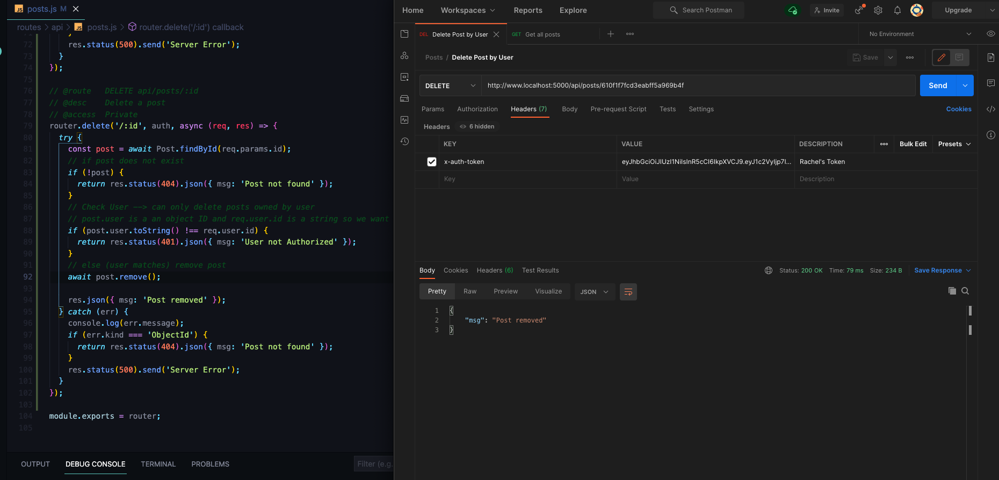

## Post Like & Unlike Routes
* We have an array inside of our post model for likes
*  PUT Request because UPDATE post is basically what is happening
    - `PUT api/posts/like/:id` --> need to know id of post being liked
    - Need to check if post has already be liked by this user --> different ways you can do this
        - use filter --> high order array method --> takes in a function and the parameter is going to be like --> compare the current iteration (i.e. the current user to the user that's logged in) --> turn this into a string so it will actually match the user ID thats in the req.user.id --> then we want to check the length of that --> will only return something if user matches and if that length is greater than zero (which means that it's already been liked) which means there is a like in there that has this user
        - if true then send 400 --> bad request
        - if user hasn't already liked it, then we want ot add on to it so we want to add on to the array, could do a push but we are going to do an unshift which just puts it on the beginning, then we want to add the user adn it's going to be the user that's logged in
        - save to database --> respond with `post.likes` because when we get to React in Redux this will matter on the front end
            ```js
            // @route   PUT api/posts/like/:id
            // @desc    Like a post
            // @access  Private
            router.put('/like/:id', auth, async (req, res) => {
              try {
                const post = await Post.findById(req.params.id);
                // Check if the post has already been liked
                if (post.likes.filter(like => like.user.toString() === req.user.id).length > 0) {
                  return res.status(400).json({ msg: 'Post already liked' });
                }
                post.likes.unshift({ user: req.user.id });
                await post.save();
                res.json(post.likes);
              } catch (err) {
                console.error(err.message);
                res.status(500).send('Server Error');
              }
            });
            ```
        - TEST IN POSTMAN --> with logged in user token --> Get like back that is the id of the like and the actually user that liked it
        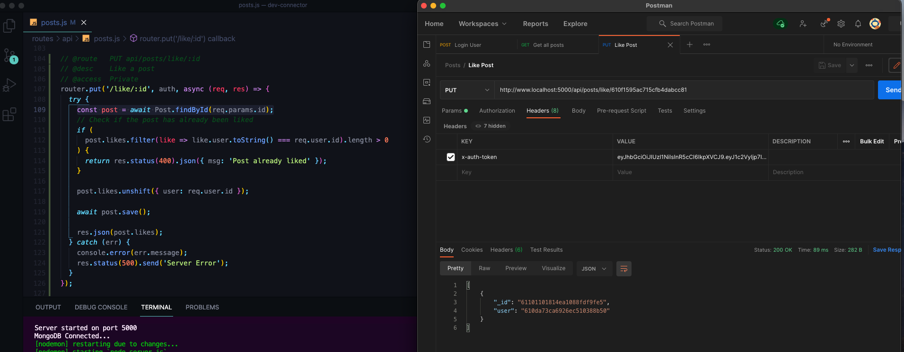
        - Try to send again and we get our error msg back
        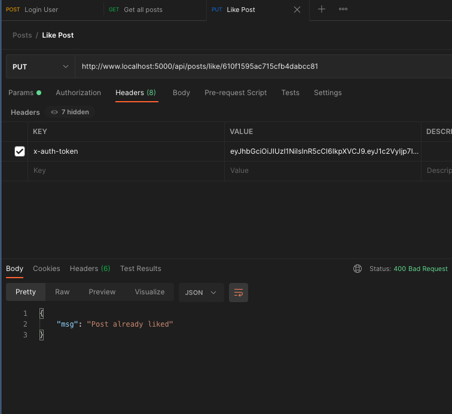
        - look in posts --> now post has a like with an id and a user
        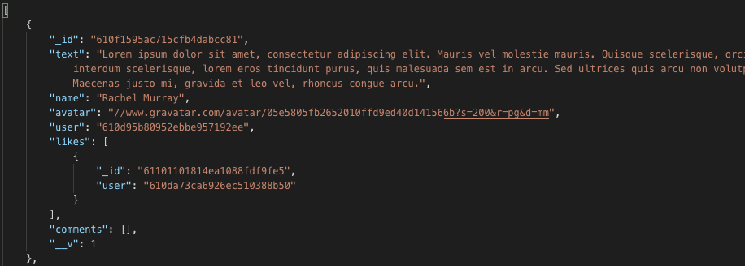
* Create route to unlike (not a dislike but a way to remove your like)
    - PUT request to `/unlike/:id`
    - see if the pst has been liked first (can't unlike a post we haven't liked yet) --> similar to like except instead of check if it's greater than zero we want to check if it's equal to zero (that means we have not liked the post yet)
    - instead of adding a like, we need to remove it based on the removeIndex (similar to experience and education with splice, toString to match ID's)
        ```js
        // @route   PUT api/posts/unlike/:id
        // @desc    Unlike a post
        // @access  Private
        router.put('/unlike/:id', auth, async (req, res) => {
          try {
            const post = await Post.findById(req.params.id);
            // Check if the post has already been liked
            if (
              post.likes.filter(like => like.user.toString() === req.user.id).length ===
              0
            ) {
              return res.status(400).json({ msg: 'Post has not yet been liked' });
            }

            //Get remove index
            const removeIndex = post.likes
              .map(like => like.user.toString())
              .indexOf(req.user.id);

            post.like.spice(removeIndex, 1);

            await post.save();

            res.json(post.likes);
          } catch (err) {
            console.error(err.message);
            res.status(500).send('Server Error');
          }
        });
        ```
      - Test in POSTMAN --> remove like and returns empty array
      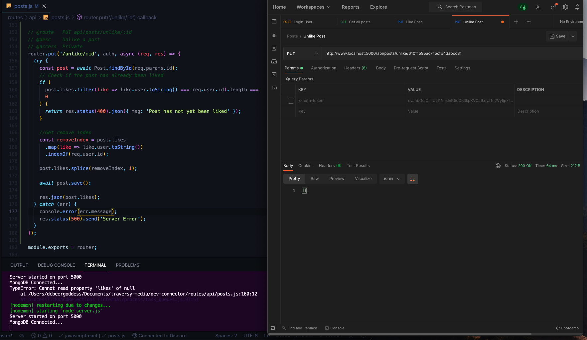

## Add & Remove Comment Routes
* Create route to add a comment to a post
    - Similar to adding a Post
    - `/api/posts/comment/:id` (need id of post)
    - Private, auth, check text (comments identical to posts but they don't have likes --> can add if want, basically same as before and would just be redundant for this tutorial)
    - need to bring in post as well as user and we can get the id from the URL (i.e. the PARAMS)
    - not a collection database so we just need to make newComment set to an object
    - add this new comment onto the post comments which we can access with post.comments (use unshift to add to beginning), pass in new comment and then we can save the post
    - don't need to put post in variable we just need to call it in this case
    - send back all the comments
        ```js
        // @route   POST api/posts/comment/:id
        // @desc    Create a post
        // @access  Private
        router.post(
          '/comment/:id',
          [auth, [check('text', 'Text is required').not().isEmpty()]],
          async (req, res) => {
            const errors = validationResult(req);
            if (!errors.isEmpty()) {
              return res.status(400).json({ errors: errors.array() });
            }
            try {
              const user = await User.findById(req.user.id).select('-password');
              const post = await Post.findById(req.params.id);

              const newComment = {
                text: req.body.text,
                name: user.name,
                avatar: user.avatar,
                user: req.user.id
              };
              //Add Comment onto Post Comments
              post.comments.unshift(newComment);

              await post.save();

              res.json(post.comments);
            } catch (err) {
              console.log(err.message);
              res.status(500).send('Server Error');
            }
          }
        );
        ```
    - Test in Postman --> with content type and user token with post ID
    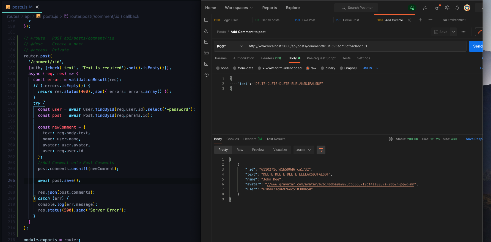
    - check in Get all Posts and see it was added to the Post object
    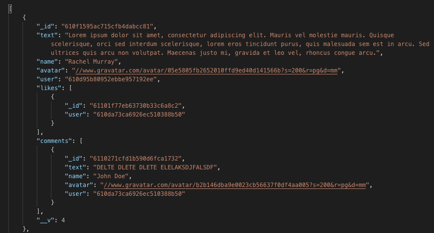
* Create Delete Post Route
    - similar to delete post
    - `api/posts/comment/:id/:comment_id` --> find the post by the id and then need to know which comment to delete
    - We want to get the post by it's id
    - pull out comment from the post --> use find method (find it by it's id, takes in function like forEach, map etc.) --> for each comment --> test where the comment.id is equal to the req.params.comment --> will give us the comment if it exists or return false, we want ot make sure our comment exists, fo if no comment than return a 404-not found status
    - then we want to make sure that the user that is deleting the comment is the user that actually made the comment
    - if comment.user (comment has user property) is equal to the user that is logged in (whish is an objectID so we want to turn it into a String) --> return error if not equal to req.user.id (401-unauthorized)
    - If all is ok then we want to find the index and delete where the index matches the removeIndex
        - **BRAD'S REMOVE INDEX LOGIC IS WRONG, IT JUST DELETES THE FIRST INSTANCE OF A COMMENT THAT MATCHES THE USER**
        - **USE THIS CODE INSTEAD SINCE WE ALREADY HAVE THE COMMENT WITH `req.params.comment_id`**
        ```js
          const removeIndex = post.comments
          .map(comment => comment.id.toString())
          .indexOf(req.params.comment_id);
        ```
        - **ALSO BEFORE SPLICE WANT TO CHECK THAT USER STILL BELONGS TO THE COMMENT IN THE INDEX**
        ```js
            // Check if it is from the user
            if (post.comments[removeIndex].user.toString() !== req.user.id) {
              return res.status(401).json({
                error: "Unauthorized. Can't delete a post from a different user"
              });
            }
        ```
    - FULL ROUTE
        ```js
          // @route   DELETE api/posts/comment/:id/:comment_id
        // @desc    Delete a comment
        // @access  Private
        router.delete('/comment/:id/:comment_id', auth, async (req, res) => {
          try {
            const post = await Post.findById(req.params.id);
            // Pull out comment
            const comment = post.comments.find(
              comment => comment.id === req.params.comment_id
            );
            // Make sure comment exists
            if (!comment) {
              return res.status(404).json({ msg: 'Comment does not exist' });
            }
            // Check user
            if (comment.user.toString() !== req.user.id) {
              return res.status(401).json({ msg: 'User not authorized' });
            }

            //Get remove index
            const removeIndex = post.comments
              .map(comment => comment.id.toString())
              .indexOf(req.params.comment_id);

            // Check if it is from the user
            if (post.comments[removeIndex].user.toString() !== req.user.id) {
              return res.status(401).json({
                error: "Unauthorized. Can't delete a post from a different user"
              });
            }

            post.comments.splice(removeIndex, 1);

            await post.save();

            res.json(post.comments);
          } catch (err) {
            console.log(err.message);
            res.status(500).send('Server Error');
          }
        });
        ```
    - TEST IN POSTMAN
    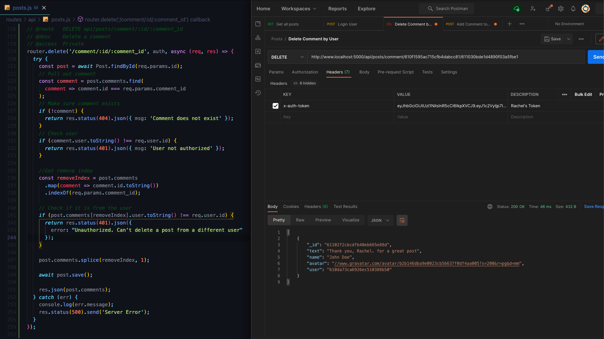
* not going to create an update route for now. Can add on ourselves or come back to later after all is said and done
* ALL THE ROUTES IN POSTMAN FOR OUR BACKEND
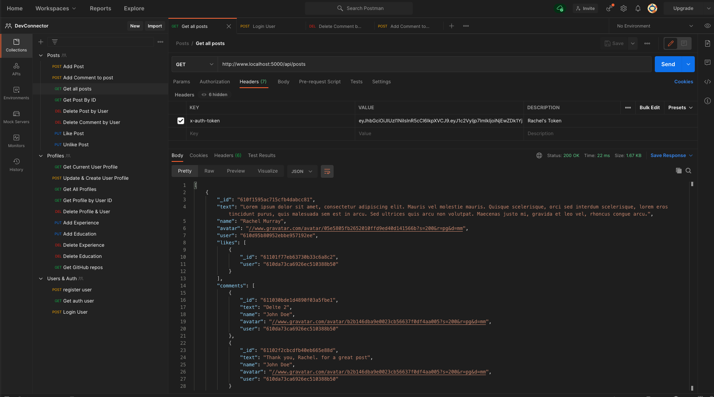
