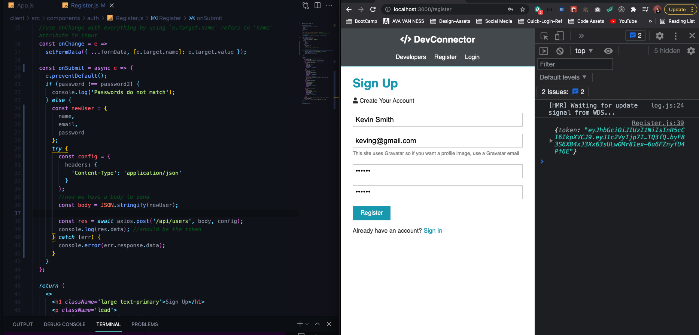

# Getting Started With React & The Frontend

## A Look At The The UI / Theme
* Ready to start with FrontEnd
* Created Custom HTML, CSS theme for the application (we'll be using it to grab from and use as JSX in React)
* Responsive Design
* Mainly CSS GRID w/ Flexbox

## Link To Theme Building Series On YouTube
* If you are interested in building the theme from scratch using HTML/CSS/Sass, TraversyMedia have a 4 part series on YouTube:
* [YouTube Theme Building Series](https://www.youtube.com/watch?v=IFM9hbapeA0&list=PLillGF-Rfqba3xeEvDzIcUCxwMlGiewfV)

## React & Concurrently Setup
* Set up React from our front end and run react server in our backend react server at the same time using `concurrently`
* Create REACT APPLICATION AND SET THIS UP IN CLIENT FOLDER `npx create-react-app client` (npx allows us to run create react app or other things like it without having to install it globally on our machine)
* CONCURRENTLY
    - set up scripts in package.json to allow us to start up both servers without having to cd into both and keep starting both up separately 
        - client: script to run client and prefix with client because we need to run it in the client folder
        - dev: will run both the server and the client -- we can do using concurrently (escape quotes with backslash)
        ```json
          "scripts": {
            "start": "node server",
            "server": "nodemon server",
            "client": "npm start --prefix client",
            "dev": "concurrently \"npm run server\" \"npm run client\""
          }
        ```
    - use `npm run dev` to start up both from the root of application
    - exit out with `ctrl + C` & `enter`
* install dependencies for the client side -- in client folder (cd into client, not in the root directory)
    - `npm i axios react-router-dom redux react-redux redux-thunk redux-devtools-extension moment react-moment`
        - **axios:** http requests (you can use fetch api, but we'll be doing some specific things with axios like creating some global headers and stuff like that)
        - **react-router-dom:** router 
        - **redux:** thunk -> middleware allows us to make a synchronous request in our actions | dev-tools: makes using redux dev tools a bit easier
        - **moment:** date and time library to format the date and time
        - **react-moment:** allows us to us moment withing the component 
* we are using our own git local version control right now so...
    - we're going to delete the .gitignore and README.md in the client folder
    - remove .git file from as well in terminal in client folder: `rm -rf .git` 
* in client side package.json --> we need to add a proxy so we don't have to type `http://localhost` etc. when we are using axios, make is so we can just do api/ whatever profile
    - add proxy after last item, browerslist (make sure it's after and not within)
    ```json
        "browserslist": {
          "production": [
            ">0.2%",
            "not dead",
            "not op_mini all"
          ],
          "development": [
            "last 1 chrome version",
            "last 1 firefox version",
            "last 1 safari version"
          ]
        },
        "proxy": "http://localhost:5000"
    ```
* RUN SERVER AGAIN --> `npm run dev`

## Clean Up & Initial Components
* in `src` folder on client side get ride of
    - serverWorker.js
    - logo.svg
    - index.css
    - App.test.js
* Get ride of references in index.js to those files and the code related to it, Now we are just rendering our main app in the index.js file
* in `App.js` --> git rid of logo and then make function into arrow function --> don't need to import React anymore and `<Fragment>` can just be `<>`
```js
import './App.css';

const App = () => (
  <>
    <h1>App</h1>
  </>
);

export default App;
```
* Delete code in `App.js` and import from theme, `style.css` and change path of showcase image on the Landing Page and bring image in
* Bring in Font Awesome to index.html (react-icons should allow us to use them without this, will recode later on)
* Clean up and remove comments from index.html in public folder

### CREATE SOME COMPONENTS
* **NAVBAR** and **LANDING**
    - create `components` folder in `src`
    - create another folder called `layout` in `components` 
    - create `Navbar.js` and `Landing.js` files in layout
    - in `Navbar.js` --> use snippets extension to create arrow function component w/ export
    - for now we are going to add static HTML output, later we'll have some state we pull from Redux and we decide what links we're going to show, now static HTML or JSX
    - grab nav tag from index.html in brads assets and landing section and paste into components, need to change all `class` attributes to `className` for react
* Import both into `App.js`
```js
import './App.css';
import Navbar from './components/layout/Navbar';
import Landing from './components/layout/Landing';

const App = () => (
  <>
    <Navbar />
    <Landing />
  </>
);

export default App;
```

## React Router Setup
* `import { BrowserRouter as Router, Route, Switch } from 'react-router-dom'`
* In order for it to work you have to wrap everything in `Router` and change embedded Landing component
```js
const App = () => (
  <Router>
    <>
      <Navbar />
      <Route exact path='/' component={Landing} />
    </>
  </Router>
);
```
* Create Auth Folder for login and register components
* class container pushes everything to the middle with the theme
* add in Switch so we don't have issues, especially when we create our private component
* change `<a>` tags to `Link` for React
    - `import { Link } from 'react-router-dom'`
    - change a tags and `href` to `to` and change paths to reflect our routes

## Register Form & useState Hook
* grab html from Brads assets for 
* with forms we need to have some components state because each input needs to have it's own state, and onChange handler
    - bring in `useState` hook
    ```js
      import { useState } from 'react';

      const Register = () => {
        const [formData, setFormData] = useState({
          //default object and values/initial state
          name: '',
          email: '',
          password: '',
          password2: ''
        });
    ```
    - similar to if you were using a class instead
    ```js
      state = {
        formData: {
          //HERE SOULD BE DATA
        }
      }
      //SET STATE
      this.setState()//pass in new values
    ```
    - Destructure form data to save syntax time
    ```js
        //DESTRUCTURE DATA -- instead of having to name.formData, etc.
        const { name, email, password, password2 } = formData;
    ```
    - can now add value to input with destructured syntax w/ JSX, and use onChange to reflect name attribute of input
    ```js
        //DESTRUCTURE DATA -- instead of having to name.formData, etc.
        const { name, email, password, password2 } = formData;
        //use onChange with everything by using `e.target.name` refers to 'name' attribute in input
        const onChange = e =>
          setFormData({ ...formData, [e.target.name]: e.target.value });
        return (
          <>
            <h1 className='large text-primary'>Sign Up</h1>
            <p className='lead'>
              <i className='fas fa-user'></i> Create Your Account
            </p>
            <form className='form' action='create-profile.html'>
              <div className='form-group'>
                <input
                  type='text'
                  placeholder='Name'
                  name='name'
                  value={name}
                  onChange={e => onChange(e)}
                  required
                />
              </div>
    ```
    * change for all inputs
    * create onSubmit function for form onSubmit --> state hook great because we have access to it from anywhere, now we are just going to console.log to test
    ```js
      const onSubmit = e => {
        e.preventDefault();
        if (password !== password2) {
          console.log('Passwords do not match');
        } else {
          console.log(formData);
        }
      };

      return (
        <>
          <h1 className='large text-primary'>Sign Up</h1>
          <p className='lead'>
            <i className='fas fa-user'></i> Create Your Account
          </p>
          <form className='form' onSubmit={e => onSubmit(e)}>
            <div className='form-group'>
    ```
- TEST IN FORM 

- we're going to want to register our user through a redux action but we have not implemented Redux yet

## Request Example & Login Form
- Test with Axios first --> import in register file
- make onSubmit async and add headers, and post to the route in our back end
```js
  const onSubmit = async e => {
    e.preventDefault();
    if (password !== password2) {
      console.log('Passwords do not match');
    } else {
      const newUser = {
        name,
        email,
        password
      }
      try {
        const config = {
          headers: {
            'Content-Type': 'application/json'
          }
        }
        //now we have a body to send  
        const body = JSON.stringify(newUser)

        const res = await axios.post('/api/users', body, config);
        console.log(res.data); //should be the token
      } catch (err) {
        console.error(err.response.data)
      }
    }
  };
```
- Test adding a new user and we should see it pop up in our MongoDB --> we will not keep this code, we will do this with redux action


* LOGIN FORM --> same as register with less fields, also need to change Links in forms