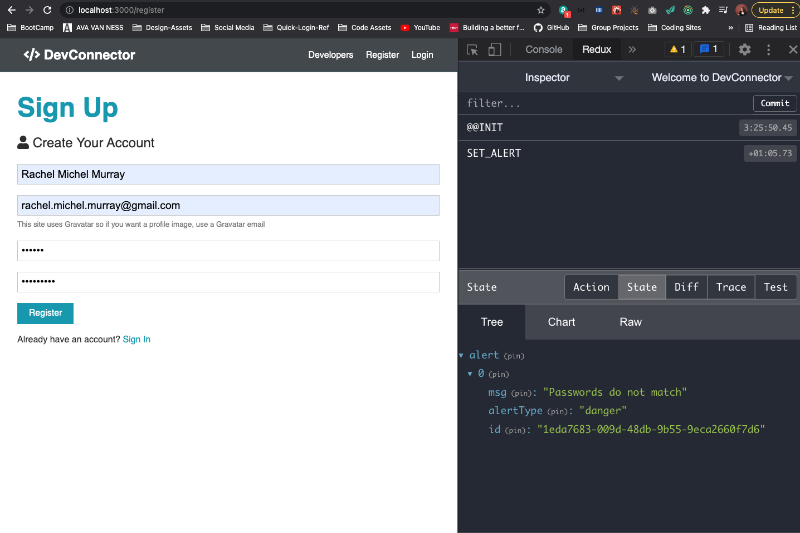

# Redux Setup & Alerts

## The Gist Of Redux
* WHY ARE WE USING REDUX
    - **Redux** is a state manager and is used for larger applications (not the ony option)
    - **Context API** built into React is a also a state manager
    - We are using quite a few **reducers** --> redux -- personal preference
* We have **component level state** in react
    - register and login forms --> input fields that data gets put in the **component level state**
    - authentication, profiles, posts --> **app level state** --> want to access from anywhere from any component
    - that's where redux comes in --> gives us app level state --> cloud that floats over application that we can submit actions to through events and we can get data to fall down into any component
    * EXAMPLE OF PROFILE SIDE OF THINGS 
    
   - profile data we get from the server is going to be put in what we can a **redux store** --> fire off an action to fetch the data and that gets put into the store (think of it as a cloud) --> from any component we can call an action that will do something
   - i.e. --> update a profile --> make a request to the server, make the update on the server(on the database), we get a response --> now we want to update our user interface --> happens through what is called a **reducer**, the reducer decides how to handle the state and how to pass it down to the components in the UI --> will update any components that use that piece of state 
   - prevents us from having to pass things around from component to competent without using a state manger
1. we call an action
2. dispatch action from or to our reducer (we will have many)
3. that reducer decides what to do with that state (are we deleting, are we updating)
4. sends state back down to all components that need it --> might have child components like about or experiences, etc. 
* Will use Authentication Reducer for state of user and we'll see certain things based on if we are logged in or not
* Redux Dev Tools --> visualize actions 

## Creating a Redux Store
* Boilerplate Code to Set up Redux Store
* Redux Dev Tools will not work until you actually create a store -> instructions given --> we installed packages that will make our code cleaner that the docs/instructions they provide you
1. inside `src` folder create file `store.js` --> Boilerplate --> function create store that you need to pass some things into and run
    - import rootReducer with relate to a index.js file we will create in a folder called reducers --> will have multiple reducers
    - This code will not have to be touched again
        ```js
        import { createStore, applyMiddleware } from 'redux';
        import { composeWithDevTools } from 'redux-devtools-extension';
        import thunk from 'redux-thunk';
        import rootReducer from './reducers';

        const initialState = {};

        const middleware = [thunk];

        const store = createStore(
          rootReducer,
          initialState,
          composeWithDevTools(applyMiddleware(...middleware))
        );

        export default store;
        ```
2. In `App.js` -- import two things --> 1. need provider (comes from react redux package) and that is what connects to since redux is separate from react --> 2. bring in store from file
    - wrap everything in `<Provider>` like we did with Router in order to use it and pass in store to Provider tag
        ```js
        // Redux
        import { Provider } from 'react-redux';
        import store from './store';

        const App = () => (
          <Provider store={store}>
        ```
3. Add to `index.js` in reducers folder will have multiple reducers but we bring in something called `combineReducers` from `redux` and then all we have to do is export default `combineReducers` --> it just takes in an object that will have any reducers we create
```js
import { combineReducers } from 'redux';

export default combineReducers({});
```
4. Now we see Redux Dev Tools with a store
    - can see actions fired off
    - can see the state
    - can see the diff in state --> what changes and then can see the trace
    - can test (jest) for testing actions


## Alert Reducer, Action & Types
* Setup Alerts we can access (like bootstrap alerts) and show
1. inside reducers create file `alert.js` and bring into `index.js` and add that to the object we passed into `combineReducers`
      ```js
      import { combineReducers } from 'redux';
      import alert from './alert';

      export default combineReducers({
        alert
      });
      ```
2. in alert.js --> function that takes in a piece of state
    - set initial state to empty array
    - alerts with be objects within the array that will have an id, a msg, alertType (success, danger, etc.)
    - function takes in initialState and an action (action with contain the type and payload--data) you might call and action type with no data, but type is mandatory
    - Type is what we need to evaluate and we will do that with a switch statement and then action is an object that should have a type attached to it
    - we want to evaluate that by cases, common convention is to use variables that are constants for types
          ```js
          const initialState = [];

          export default function(state = initialState, action) {
              switch(action.type) {
                case 'SET_ALERT'
              }
          }
          ```
    - inside src folder, create folder called actions --> the is where all our action files with go and where we make HTTP request and stuff like that
    - files called `types.js` that is going to hold all of our variables/all our constants --> some people call it `constants.js`
          ```js
          export const SET_ALERT = 'SET_ALERT';
          export const REMOVE_ALERT = 'REMOVE_ALERT';
          ```
    - makes it easier if we need to change it (only have to change it in one place), central file of all action types in one place as well
    - BACK TO `alert.js` --> bring in constants and we can now set case to a variable instead of a string
          ```js
          import { SET_ALERT, REMOVE_ALERT } from '../actions/types';

          const initialState = [];

          export default function (state = initialState, action) {
            switch (action.type) {
              case SET_ALERT:
                return []
            }
          }
          ```
    - we need to decided what we want to send down as far as state depending on the type
    - we are going to return for the state, an array, because the case or action here is set alert so we're adding an alert, state is immutable so we are going to use th spread operator and say state for any state that is already there, so if there is already an alert in there we want to copy it and add our new alert -- we'll have `action.payload` and we'll have the data inside of a payload (payload with have msg, id, and alertType)
    - for `REMOVE_ALERT` --> we want to remove and alert based on it's id --> return state which is an array and filter through the alerts and for each alert you want to check if the alert id is not equal to the payload (payload in this case is just an id) --> will make more sense when you see the actions file we create and when we actually dispatch these
    - for default just return the state
    ```js
      import { SET_ALERT, REMOVE_ALERT } from '../actions/types';

      const initialState = [];

      export default function (state = initialState, action) {
        const { type, payload } = action;
        switch (type) {
          case SET_ALERT:
            return [...state, payload];
          case REMOVE_ALERT:
            return state.filter(alert => alert.id !== payload);
          default:
            return state;
        }
      }
    ```
    - create `alert.js` files in actions -> import set alert and remove alert because we are going to dispatch these
        - we can to be able to dispatch more than one action from our action type --> can use dispatch here like this because of our `thunk` middleware
        - function takes in msg and alertType for now
        - we want to randomly generate id (could use vanilla javascript)--> install package call `UUID` that will give us a universal id on the fly (install package in client side package.json): `npm i uuid` 
          ```js
          import uuid from 'uuid';
          import { SET_ALERT, REMOVE_ALERT } from './types';

          export const setAlert = (msg, alertType) => dispatch => {
            const id = uuid.v4();
            dispatch({
              type: SET_ALERT,
              payload: { msg, alertType, id }
            });
          };
          ```

## Alert Component & Action Call
* WE have and action called `SET_ALERT` --> going to dispatch the type of setAlert ot eh reducer and it's going ot add the alert to state which is initially an empty array
* Example of Calling this Array
    - When user Registers, where we console logged the 'Passwords do not Match' we actually want to set an alert with that message
    - We are going to connect this component to Redux with `Connect` with is available with the `react-redux` package (when you use connect you also need to export it) --> also need to import the action --> and bring action into `connect()` (takes in two things, any state you want to map, here we will make it null for now, second is an object with any actions you want to use) --> ALLOWS US TO ACCESS `props.setAlert` so pass props into component function
    - change console.log to props.setAlert('Passwords do not match', 'danger') --> ccs is set up like bootstrap with alert classes, will be dynamic later
```js
import { useState } from 'react';
import { Link } from 'react-router-dom';
import { connect } from 'react-redux';
import { setAlert } from '../../action/alert';
const Register = (props) => {
  const [formData, setFormData] = useState({
```
```js
export default connect(null, { setAlert })(Register);
```
```js

  const onSubmit = e => {
    e.preventDefault();
    if (password !== password2) {
      props.setAlert('Passwords do not match', 'danger');
    } else {
      console.log('Success');
    }
  };
```
- If we try to register with passwords that do not match we can see in our Redux Dev Tools the change in state and the action



- Now we will want to display this in our UI --> Create Alert Component in our layout folder
- Destructure props in Register to just be `({ setAlert })` and then we don't need to keep typing `props.setAlert` 
- also need to bring in PropTypes and declare them at bottom before export default
```js
import { setAlert } from '../../actions/alert';
import PropTypes from 'prop-types';

const Register = ({ setAlert }) => {
  const [formData, setFormData] = useState({
```
```js
Register.propTypes = {
  setAlert: PropTypes.func.isRequired,
}

export default connect(null, { setAlert })(Register);
```
- In Component for Alert.js
    - use connect --> anytime you want to interact a component with Redux, whether you are calling an action or getting the state you want to use connect
    - in this case we want to ge the alert state, we want to fetch that array from Redux dev tools into this component --> create variable called `mapStateToProps` because that is exactly what we're doing --> so component has access to it
        - arrow function, takes state in as a parameter, and then we cant to set this to some parentheses with curly braces and then whatever state we want or whatever prop we want ot call (alerts) and whatever we want from the rood reducers 
        - now we have `props.alerts` available to us (destructure props)
    - now we just want to map through the alerts and output and whatever the messages along with the class for styling and also make sure that it's not null
        - you don't want to output anything if array is zero either
        - map through alerts (like for each but returns something) and we will return some JSX inside a div
        - will be a list so you need to have a unique key --> dynamic to alert's id
        - style is dynamic based on alertType
        - and then display msg in alert
            ```js
            import PropTypes from 'prop-types';
            import { connect } from 'react-redux';

            const Alert = ({ alerts }) =>
              alerts !== null &&
              alerts.length > 0 &&
              alerts.map(alert => (
                <div key={alert.id} className={`alert alert-${alert.alertType}`}>
                  {alert.msg}
                </div>
              ));

            Alert.propTypes = {
              alerts: PropTypes.array.isRequired
            };

            const mapStateToProps = state => ({
              alerts: state.alert
            });

            export default connect(mapStateToProps)(Alert);
            ```
    - embed into App.js `import Alert from './components/layout/Alert'`
        - put it in the container but above the switch (switch can only have routes in it)
* TEST OUT IN APP


* RECAP
    - in `Register.js` --> brought in `connect`, `setAlert` action
        - export connect with setAlert action to order to use it
        - then it's available within props adn we destructured it
        - called it when passwords do not match and set the message and alertType
    - in `actions/alert.js` --> that's what is being called
        - we se the msg, and alert type and generated an id
        - dispatched setAlert with the message, alertType, and ID
    - in  `reducers/alert.js` --> we added that to the array we saw that within Redux Dev Tools
    
    - in `Alert.js` component --> is getting that state and we are mapping state to props, getting the alert state and putting it inside a prop of alerts that we destructured and passed in alerts, making sure it's not null and that it has something in it --> if it does we are going map through them and output a div with the message and the styling passed on the alert type
    - RIGHT NOW: We will keep stacking the same message in the UI --> need to get rid of them
* Remove Message --> trigger from actions (we could put and 'X' to submit) --> we are going to do a setTimeOut to remove the alert after a certain amount of seconds
    - in actions file
        - dispatch `REMOVE_ALERT` --> type is remove, and only thing we need fro payload is the id 
        - setTimeout --> JS Function --> two parameters: 1. function 2. time we ant to wait (5 seconds)
        - our REDUCER is just going to filter out that payload, match that id to the payload
            ```js
            export const setAlert = (msg, alertType) => dispatch => {
              const id = uuid.v4();
              dispatch({
                type: SET_ALERT,
                payload: { msg, alertType, id }
              });

              setTimeout(() => dispatch({ type: REMOVE_ALERT, payload: id }), 5000);
            };
            ```
        - alert goes away after 5 seconds and we can see in dev tools
        
    - quick change, we want to be able to pass in the time for the alert instead of having it all 5 seconds (default will be 5 seconds)
```js
  import uuid from 'uuid';
import { SET_ALERT, REMOVE_ALERT } from './types';

export const setAlert =
  (msg, alertType, timeout = 5000) =>
  dispatch => {
    const id = uuid.v4();
    dispatch({
      type: SET_ALERT,
      payload: { msg, alertType, id }
    });

    setTimeout(() => dispatch({ type: REMOVE_ALERT, payload: id }), timeout);
  };
```