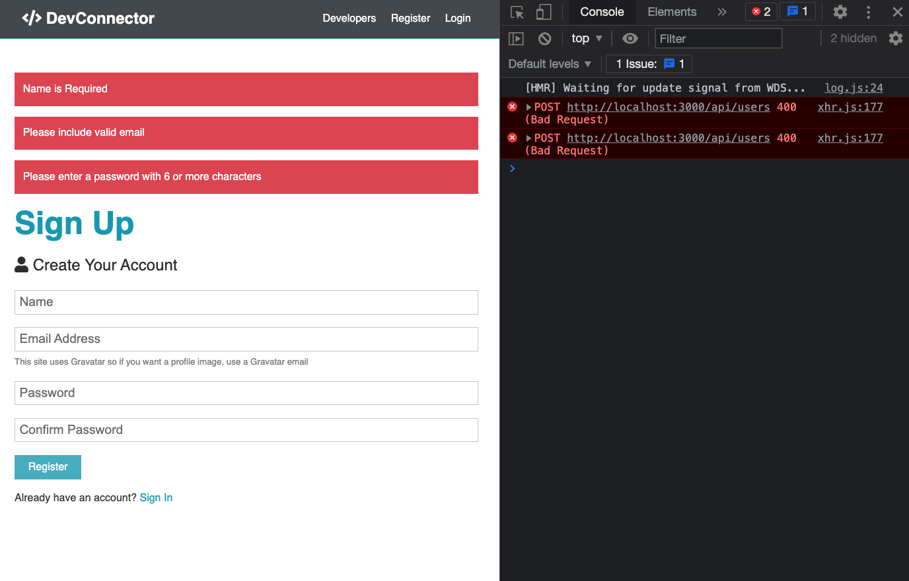
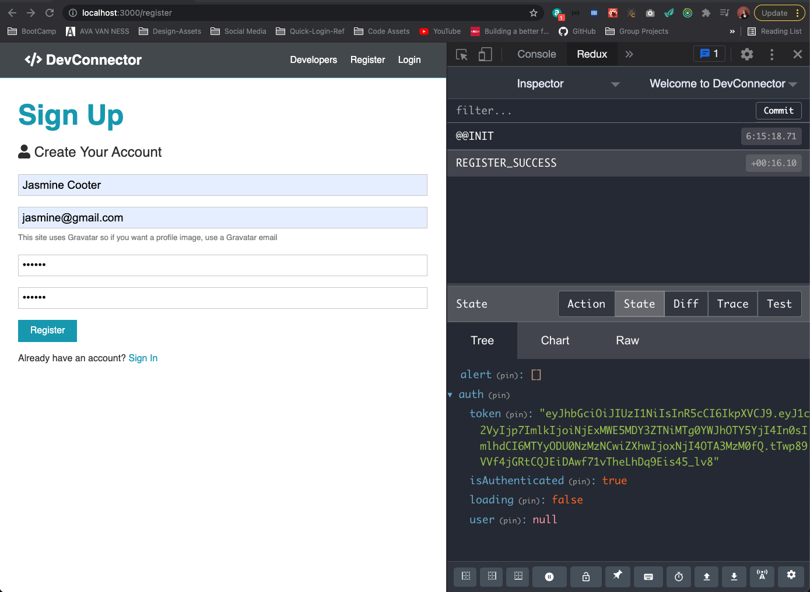
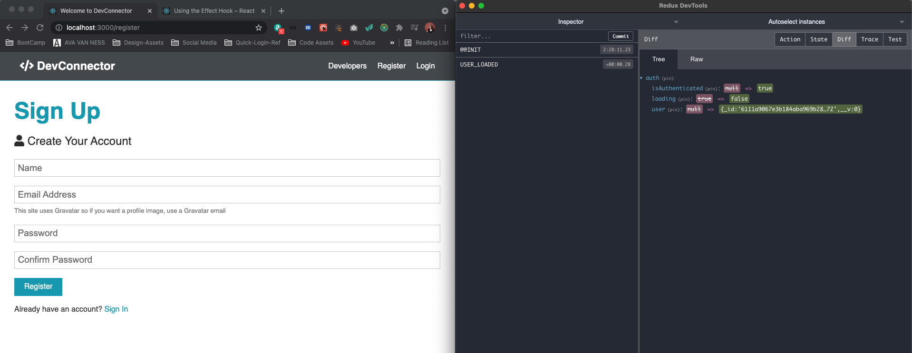
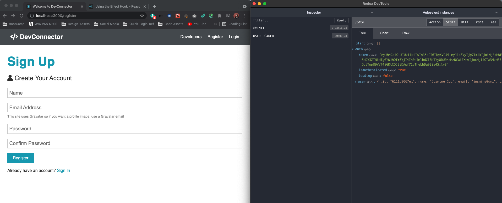
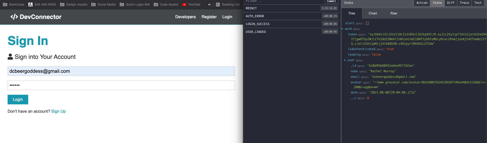

# React User Authentication

## Auth Reducer & Register Action

- create reduces for auth
- create file in `reducers` called `auth.js`
  - FOCUS ON REGISTER USER
- in `actions/types.js` --> `REGISTER_SUCCESS` and `REGISTER_FAIL`
  - We are going to have to deal with the backend --> working with HTTP Requests --> place to do our axios request to the backend is going to be in our `actions` folder under `auth.js` where we make request and ge the response and then dispatch `REGISTER_SUCCESS` or `REGISTER_FAIL`
- import actions into the `auth.js` in our reducers

  - initialState = object with a few things
    - `token` that we get back which we are going to save in local storage, with just vanilla JS, look for an item in local storage called token, and that's going to be the default for the token in our state
    - next we want it's authenticated value, set to null to being with --> what will happen is when we make a request to register or login and we get success we are going to set isAuthenticated to true (what we check to make the navbar, or have the dashboard, logout and etc)
    - add `loading` because we want to make sure that when we load a user or a user is authenticated we want to make sure the loading is done so that we've already made a request to the backend and it got a response --> set to true by default and then once we make our request and get our data or response back then we'll set it to false so we know that it's been loaded
    - `user` set to null by default, when we make a request to the backend to `api/auth` and we get the user data, we will put all that in here and that's our state for authentication
  - need export default function (takes in two things, 1. state 2. action to dispatch)
    - destructure type and payload from the action and run a switch on the type
    - if register is a success we want to get the token back so the user gets logged in right away --> so we take token and we want to setItem token in localStorage to the token we are getting back from our payload/data
    - then spread operator state because we want to return whatever is already in state and the payload, and isAuthenticated now set to true and loading to false
  - make sure to add default and return state for switch statement
  - add case for REGISTER_FAIL

    - we are going to remove anything that's in local storage in that token completely
    - return state (not payload), set token state to null and authentication to false and loading stays false because even though it failed, it's still done loading

      ```js
      import { REGISTER_SUCCESS, REGISTER_FAIL } from '../actions/types';

      const initialState = {
        token: localStorage.getItem('token'),
        isAuthenticated: null,
        loading: true,
        user: null
      };
      export default function authReducer(state = initialState, action) {
        const { type, payload } = action;

        switch (type) {
          case REGISTER_SUCCESS:
            localStorage.setItem('token', payload.token);
            return {
              ...state,
              ...payload,
              isAuthenticated: true,
              loading: false
            };
          case REGISTER_FAIL:
            localStorage.removeItem('token');
            return {
              ...state,
              token: null,
              isAuthenticated: false,
              loading: false
            };

          default:
            return state;
        }
      }
      ```

- Create file in `actions` for `auth.js`

  - bring in axios
  - import register success and fail
  - have action called Register export a function will take in a name, email and password adn using dispatch with async before dispatch, similar to what we did back when we tested the request within the Register component --> doing it from an action and need to config with headers because we are sending data in this case
  - prepare data in body to send with stringify
  - await on axios post res and pass in our endpoint `/api/users`, and then the body we've prepared, and then the config
  - dispatch success if we don't get like a 400 error or whatever - type = success and payload = data e are getting back which in this case is the `token`
  - if fail then dispatch the register fail and you don't need to do anything with the payload
  - display errors if we forget name, email or password, etc. or email is not formatted correctly, we are going to get an array of errors from our backend

    - show an alert for each error
    - import setAlert action
    - loop through errors --> create variable for errors and set that to error we can get body errors with err.response.data.errors since we called that array errors (check for errors and if for each error we want to dispatch setAlert (danger alert))

      ```js
      import axios from 'axios';
      import { setAlert } from './alert';
      import { REGISTER_SUCCESS, REGISTER_FAIL } from './types';

      //REGISTER USER
      export const register =
        ({ name, email, password }) =>
        async dispatch => {
          const config = {
            headers: {
              'Content-Type': 'application/json'
            }
          };
          //prepare data to send
          const body = JSON.stringify({ name, email, password });

          try {
            const res = await axios.post('/api/users', body, config);

            dispatch({
              type: REGISTER_SUCCESS,
              payload: res.data
            });
          } catch (err) {
            const errors = err.response.data.errors;

            if (errors) {
              errors.forEach(error => dispatch(setAlert(error.msg, 'danger')));
            }
            dispatch({
              type: REGISTER_FAIL
            });
          }
        };
      ```

    - Now we have action set up we need to go to our Register Component and basically integrate it, import, export, PropTypes, add to parameters to destructure from props, and then call it where you submit the console.log with success

      ```js
      import { setAlert } from '../../actions/alert';
      import { register } from '../../actions/auth';
      ```

      ```js
      Register.propTypes = {
        setAlert: PropTypes.func.isRequired,
        register: PropTypes.func.isRequired
      };

      export default connect(null, { setAlert, register })(Register);
      ```

      ```js
      const Register = ({ setAlert, register }) => {
        const [formData, setFormData] = useState({
      ```

      ```js
      const onSubmit = e => {
        e.preventDefault();
        if (password !== password2) {
          setAlert('Passwords do not match', 'danger', 4000);
        } else {
          register({ name, email, password });
        }
      };
      ```

      - ERRORS MESSAGES WORKING --> disabled client side HTML5 required fields and password min for now 
      - Register a user and it's getting added to the database but we forgot to add it to our rootReducer so we are not seeing it in State in the dev tools
      - Add to rootReducer and add a new user 

## Load User & Set Auth Token

- Handle process of taking token we have stored, sending it to the backend for validation and then loading the user
- want to happen every single time the app is loaded
- We already have a token in our state --> make sure that the user's validated, otherwise it's going ot clear out the token as well as the other stuff clared
- JWT tokens are stateless and once we register a user it does not stay there
- We have to kee making a request to the backend - to `/api/auth` - check for user with the `req.user.id` which is included in the token, we created our middleware to validate the token and then put the user in `req.user.id`

* Start off in `actions/types.js`
  - CREATE 1. `USER_LOADED` (i.e. success) & `AUTH_ERROR` (fail)
* in `actions/auth.js` bring in types and create new function

  - async with dispatch for `loadUser`
  - Need to check if there's a token and if there is put it in a global header (x-auth-token) and send that
  - created separate file `setAuthToken.js` in a folder call `utils` --> utility/helper

    - function that takes in a token, if the token is there (in localStorage), it's going to add it to the headers
    - if not, it's going to delete it from the headers
    - need `axios` (not making a request with axios, just adding a global header)

      ```js
      import axios from 'axios';

      const setAuthToken = token => {
        if (token) {
          axios.defaults.headers.common['x-auth-token'] = token;
        } else {
          delete axios.defaults.headers.common['x-auth-token'];
        }
      };

      export default setAuthToken;
      ```

  - back in `actions/auth.js` and we're going to want ot check local storage (do this here and in main `App.js` file)

    - set header if there is a token in local storage
    - then make our requests --> try/catch
    - await get response from axios, want to hit endpoint `'api/auth'`
    - if all goes well we `dispatch` -- `type` = `USER_LOADED` and `payload` is going to be the `res.data` that is sent from that route which is the user and send it to the action type in the reducer
    - if something goes wrong we are going to dispatch `AUTH_ERROR`

      ```js
      import {
        REGISTER_SUCCESS,
        REGISTER_FAIL,
        USER_LOADED,
        AUTH_ERROR
      } from './types';
      import setAuthToken from '../utils/setAuthToken';

      // Load User
      export const loadUser = () => async dispatch => {
        //set header with token if there is one
        if (localStorage.token) {
          setAuthToken(localStorage.token);
        }

        try {
          const res = await axios.get('/api/auth');

          dispatch({
            type: USER_LOADED,
            payload: res.data
          });
        } catch (err) {
          dispatch({
            type: AUTH_ERROR
          });
        }
      };
      ```

  - In `reducers/auth.js` handle both user loaded and auth error
    - for `USER_LOADED`
      - if that's the case, return our state, set isAuthenticated to true because the user token worked, we are now logged in, set loading to false and and set the user as the payload (name, email, avatar, etc. --> except the password since that's how we set it up in our backend route)
        ```js
          switch (type) {
            case USER_LOADED:
              return {
                ...state,
                isAuthenticated: true,
                loading: false,
                user: payload
              }
        ```
    - for `AUTH_ERROR`
      - same as REGISTER_FAIL --> remove token and clear everything out
        ```js
            case REGISTER_FAIL:
            case AUTH_ERROR:
              localStorage.removeItem('token');
              return {
                ...state,
                token: null,
                isAuthenticated: false,
                loading: false
              };
        ```

* Now we want to run the load user action, we've created it but we need to go to our main `App.js`

  - To call this we need to useEffect
  - React classes --> lifecycle methods like component did mount --> that would be where we would call this if we were using a class however we are using functions, and we can bring in the useEffect hook and put it within our function, add curly braces to App function and add a return so we can add functions above the return
  - useEffect --> takes in a function, the way we can dispatch this load user action from here is by taking the store directly because we have access to the store `dispatch.store` (dispatch is a method on the store) and pass in loadUser

    - kind of a gotcha with useEffect, when state updates this will keep running (constant loop) unless we go ahead and add a second parameter with some empty brackets, by doing this we make it so this only runs once when it's loaded (i.e. mounted) empty set of brackets is basically haveing a component did mount like with React classes (you can put certain properties in here that will make this only update if those properties update) --> tells react that your effect doesn't depend on any values from props or state, just run once

      ```js
      // Redux
      import { Provider } from 'react-redux';
      import store from './store';
      import { loadUser } from './actions/auth';
      import { setAuthToken } from './utils/setAuthToken';

      import './App.css';

      if (localStorage.token) {
        setAuthToken(localStorage.token);
      }

      const App = () => {
        useEffect(() => {
          store.dispatch(loadUser());
        }, []);
      ```

* More On Hooks --> [Using the Effect Hook Docs](https://reactjs.org/docs/hooks-effect.html)
* We can see the state of our user changed in the Redux Dev Tools  

## User Login

- At This point we can register a user which gives us a token and we created loadUser action which will take that token and basically send a request to teh API auth route and then we get the user back
- Now we need a way to actually log in without having to register another user
  - log user out --> clear out token from chrome dev tools in local storage under application and delete it (we don't have logout functionality yet)

* USER LOGIN

  - similar to REGISTER USER --> in `actions/auth.js`
    - don't need the name, just email and password so don't need to pass it in as an object in the parameters
    - request is being sent to `/api/auth` since we are logging in/authenticating
    - if success we'll have a LOGIN_SUCCESS action type and send the data as a payload
    - if something goes wrong, we want to do the same thing where we're sending an alert if we get errors --> have to have some body validation for the login as well --> then dispatch LOGIN_FAIL if something goes wrong
  - Create `types` for LOGIN_SUCCESS and LOGIN_FAIL --> Bring into `actions`

            ```js
            // LOGIN USER
            export const login = (email, password) => async dispatch => {
              const config = {
                headers: {
                  'Content-Type': 'application/json'
                }
              };
              //prepare data to send
              const body = JSON.stringify({ email, password });

              try {
                const res = await axios.post('/api/auth', body, config);

                dispatch({
                  type: LOGIN_SUCCESS,
                  payload: res.data
                });
              } catch (err) {
                const errors = err.response.data.errors;

                if (errors) {
                  errors.forEach(error => dispatch(setAlert(error.msg, 'danger')));
                }
                dispatch({
                  type: LOGIN_FAIL
                });
              }
            };
            ```

    - in `reducer` need to handle what happens when either of these fire off
      - `LOGIN_SUCCESS` does the same thing `REGISTER_SUCCESS`
      - `LOGIN_FAIL` is same as `REGISTER_FAIL` and `AUTH_ERROR`
    - NOW WE NEED A WAY TO FIRE OFF THE ACTION

      - COMES FROM COMPONENTS -- `Login.js`
      - use `connect` from `react-redux`
      - bring in `PropTypes` and `login` from the actions
      - export connect with map to state as null for now and actions login, login is a prop so add in propTypes
      - we don't need to separate the onSubmit out you can just do it in JSX but keep it same as register for now

        ```js
        import { useState } from 'react';
        import { Link } from 'react-router-dom';
        import { connect } from 'react-redux';
        import PropTypes from 'prop-types';
        import { login } from '../../actions/auth';

        const Login = ({ login }) => {
          const [formData, setFormData] = useState({
            //initial state
            email: '',
            password: ''
          });
        ```

        ```js
        Login.propTypes = {
          login: PropTypes.func.isRequired
        };

        export default connect(null, { login })(Login);
        ```

        ```js
        //DESTRUCTURE DATA -- instead of having to name.formData, etc.
        const { email, password } = formData;
        //use onChange with everything by using `e.target.name` refers to 'name' attribute in input
        const onChange = e =>
          setFormData({ ...formData, [e.target.name]: e.target.value });

        const onSubmit = e => {
          e.preventDefault();
          login(email, password);
        };
        ```

* ALSO need to dispatch the loadUser in both login and register in `actions/auth.js`

```js
  try {
    const res = await axios.post('/api/auth', body, config);

    dispatch({
      type: LOGIN_SUCCESS,
      payload: res.data
    });

    dispatch(loadUser());
```

- NOW LOGIN WITH A USER AND WE see the state changes with the user token and payload data 
- WE want to bring our auth state into `Login.js` component and redirect the user when they login

  - create `mapStateToProps ` to get the auth state --> all we need to `isAuthenticated`
  - add to prop types as boolean

    ```js
    Login.propTypes = {
      login: PropTypes.func.isRequired,
      inAuthenticated: PropTypes.bool
    };

    const mapStateToProps = state => ({
      isAuthenticated: state.auth.isAuthenticated
    });

    export default connect(mapStateToProps, { login })(Login);
    ```

  - go above return and redirect if logged in
  - with `react-router-dom` we can do a `<Redirect to="#">` (bring in where you brought in LINK )
  - will crate dashboard later on
    ```js
    // Redirect if logged in
    if (isAuthenticated) {
      return <Redirect to='/dashboard' />;
    }
    ```
  - Do the same for register
  - Login in with react app, when logged in if you go to `register` or `login` it takes you to `/dashboard` instead

## Logout & Navbar Links

- Create Logout Action that will clear everything
- Change NavBar based on whether or not a user is logged in

1. Create `LOGOUT` type
2. Bring into `actions/auth.js` and write logic

```js
// LOGOUT / CLEAR PROFILE
export const logout = () => dispatch => {
  dispatch({ type: LOGOUT });
};
```

3. in `reducers/auth.js` --> bring in type, and same as `REGISTER_FAIL... etc`
4. now in `Navbar.js`, which right now is a dumb component and it just displays some markup

   - Bring in connect--> auth state, PropTypes, logout
   - mapStateToProps --> we want our auth state
   - PropTypes --> bring in logout actions, and the auth state whish is an object
   - add props to the parameters, for auth we are going to pull out isAuthenticated and loading because we want to make sure that the user is done loading before we put the link in

     ```js
     Navbar.propTypes = {
       logout: PropTypes.func.isRequired,
       auth: PropTypes.object.isRequired
     };

     const mapStateToProps = state => ({
       auth: state.auth
     });

     export default connect(mapStateToProps, { logout })(Navbar);
     ```

     ```js
     import { Link } from 'react-router-dom';
     import { connect } from 'react-redux';
     import PropTypes from 'prop-types';
     import { logout } from '../../actions/auth';

     const Navbar = ({ auth: { isAuthenticated, loading }, logout }) => {
     ```

   - Create a couple variables for guest links and auth links
   - put in html, for logout we are using font awesome icon that when on small screen will hide the text and only have an icon (have special class from the css resources brad made)
   - In the nav bar itself, a few things you can do --> we can us the double ampersand, so basically we are saying that if not loading then do this...

     - what we want to do here is just show a frament adn inside the fragment we are going to put a ternary to check to see if we're authenticated and if we are logged in we show the auth links, otherwise show guestlinks

       ```js
       const Navbar = ({ auth: { isAuthenticated, loading }, logout }) => {
         const authLinks = (
           <ul>
             <li>
               <Link onClick={logout} to='#!'>
                 <i className='fas fa-sign-out-alt'></i> <span className='hide-sm'>Logout</span>
               </Link>
             </li>
           </ul>
         );

         const guestLinks = (
           <ul>
             <li>
               <Link to='#!'>Developers</Link>
             </li>
             <li>
               <Link to='/register'>Register</Link>
             </li>
             <li>
               <Link to='/login'>Login</Link>
             </li>
           </ul>
         );

         return (
           <nav className='navbar bg-dark'>
             <h1>
               <Link to='/'>
                 <i className='fas fa-code'></i> DevConnector
               </Link>
             </h1>
             {!loading && <>{isAuthenticated ? authLinks : guestLinks}</>}
           </nav>
         );
       };
       ```
