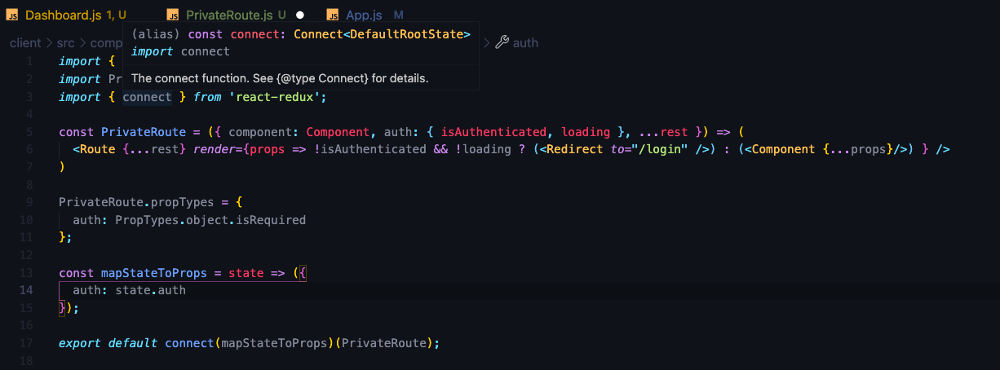
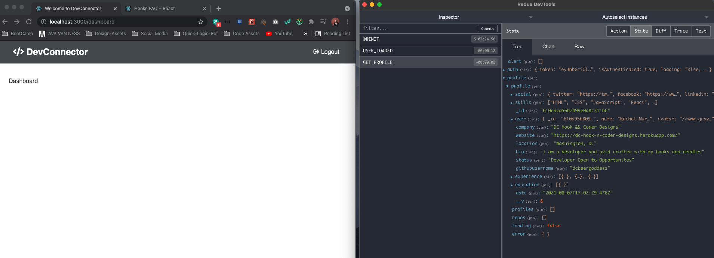
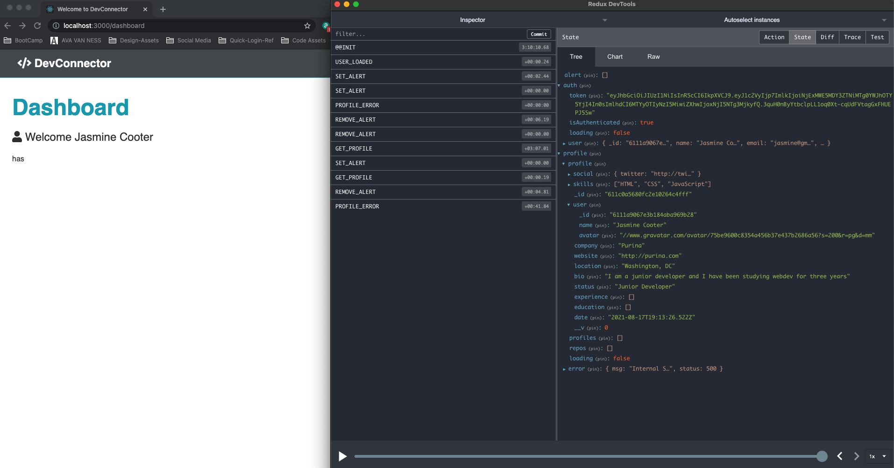

# Dashboard & Profile Management

## Protected Route For Dashboard

- In main Dashboard component, this is where we are going to fetch all our data, adn we'll pass it down to other components (for instance, education and experience components)

  - create function component with PropTypes
  - bring Dashboard into App.js and add a route
  - protect the route --> create private route component to add to routes in App.js

    - arrow function with properties, need to accept the component prop and anything else that is passed into the route in App.js
    - pass in the rest operator (this will take in anything else that's passed in)
      - `const PrivateRoute = ({ component: Component, ...rest }) => {`
    - need to interact with the auth state in our auth reducer ir order for this to work
    - bring in connect from react-redux
    - need redirect from the router
    - need to export connect and map state to props but no action
    - mapState is the auth state --> bring into propTypes as well as an object and bring auth into parameter for PrivateRoute function as a prop
    - don't need return statement, just a route that we are going to pass a bunch of stuff into (including, ...rest) and then render props, and this is where we will check to see if we are authenticated or not and if loading is true, the we want to redirect if it's not to the login page, else load with whatever the component is 
    - import file to App.js and change route

              ```js
                  <Provider store={store}>
                    <Router>
                      <>
                        <Navbar />
                        <Route exact path='/' component={Landing} />
                        <section className='container'>
                          <Alert />
                          <Switch>
                            <Route exact path='/register' component={Register} />
                            <Route exact path='/login' component={Login} />
                            <PrivateRoute exact path='/dashboard' component={Dashboard} />
                          </Switch>
                        </section>
                      </>
                    </Router>
                  </Provider>
              ```

## Profile Reducer & Get Current Profile

- Now as soon as the dashboard loads, we want to pull current user's profile
  - need profile in our state --> profile reducer, profile actions
- Reducer --> actions ot get profile, create, and update
- Need to put types in actions and create profile.js in actions

```js
// GET CURRENT USERS PROFILE
export const getCurrentProfile = () => async dispatch => {
  try {
    // know what profile to load from the token we sent so you do not need id
    const res = await axios.get('api/profile/me');

    dispatch({
      type: GET_PROFILE,
      payload: res.data
    });
  } catch (err) {
    dispatch({
      type: PROFILE_ERROR,
      payload: { msg: err.response.statusText, status: err.response.status }
    });
  }
};
```

- set initial state in reducer and put in our types

```js
import { GET_PROFILE, PROFILE_ERROR } from '../actions/types';

const initialState = {
  profile: null,
  profiles: [],
  repos: [],
  loading: true,
  error: {}
};

export default function profileReducer(state = initialState, action) {
  const { type, payload } = action;

  switch (type) {
    case GET_PROFILE:
      return {
        ...state,
        profile: payload,
        loading: false
      };
    case PROFILE_ERROR:
      return {
        ...state,
        error: payload,
        loading: false
      };
    default:
      return state;
  }
}
```

- Back in Dashboard Component we want to call this get profile action as soon as we go to the dashboard--> import connect
  - mapStateToProps needs auth state and profile state
  - need useEffect hook in order to get teh current profile as soon as it loads (pass getCurrentProfile into the array otherwise you have a dependency error also did ignore next line... hopefully doesn't cause issues later)

```js
import { useEffect } from 'react';
import PropTypes from 'prop-types';
import { connect } from 'react-redux';
import { getCurrentProfile } from '../../actions/profile';

const Dashboard = ({ getCurrentProfile, auth, profile }) => {
  // eslint-disable-next-line
  useEffect(() => {
    getCurrentProfile();
  }, [getCurrentProfile]);

  return <div>Dashboard</div>;
};

Dashboard.propTypes = {
  getCurrentProfile: PropTypes.func.isRequired,
  auth: PropTypes.object.isRequired,
  profile: PropTypes.object.isRequired
};

const mapStateToProps = state => ({
  auth: state.auth,
  profile: state.profile
});

export default connect(mapStateToProps, { getCurrentProfile })(Dashboard);
```

- Look in Redux DevTools and we are getting the state of the current user's profile and what we have in there already 

## Starting On The Dashboard

- Add link in Navbar for Dashboard with font awesome user icon
- Change Landing Page if you are logged in --> bring connect into landing page because we need to deal with state to see if we are logged in or not

```js
import { Link, Redirect } from 'react-router-dom';
import { connect } from 'react-redux';
import PropTypes from 'prop-types';

const Landing = ({ isAuthenticated }) => {
  if (isAuthenticated) {
    return <Redirect to='/dashboard' />;
  }
  //BOTTOM OF FILE
  //
  //
Landing.propTypes = {
  isAuthenticated: PropTypes.bool
};

const mapStateToProps = state => ({
  isAuthenticated: state.auth.isAuthenticated
});

export default connect(mapStateToProps)(Landing);
```

- BACK IN DASHBOARD.js COMPONENT
  - want to make sure profile is loaded and not null, if so, want to show spinner graphic
  - create spinner component in layouts --> will load a gif (GOING TO USE FONT AWESOME INSTEAD)
  - create test for whether a user has a profile or not, however we need to clear profile of last logged in user when they log out, right now if we don't reload the page then the last user that was logged in with have their profile in state event if new user that logged in does not have a profile yet.

```js
  return loading && profile === null ? (
    <Spinner />
  ) : (
    <>
      <h1 className='large text-primary'>Dashboard</h1>
      <p className='lead'>
        {/* check to see if user is there with double ampersand --> need to destructure user from auth above */}
        <i className='fas fa-user'></i> Welcome {user && user.name}
      </p>
      {/* Show something different if the profile isn't there */}
      {profile !== null ? <>has</> : <>has not</>}
    </>
  );
};

```

- Back in types we want to add clear profile --Bring into auth actions because you want to dispatch when a user logs out before you log them out, then create reducer in profile reducer file

## CreateProfile Component

- Create route and component which will be a form to add profile for this user

1. Create Component --> new folder `profile-forms`

   - set useState variables
   - destructure all form variables from formData
   - import html from brad's assets for the form

2. Create PrivateRoute for component in App.js to see form when you hit `/create-profile`

3. Insert new piece of state to toggle add Social media links

```js
// SET UP INITIAL STATE AND ACTION
const [displaySocialInputs, toggleSocialInputs] = useState(false);
// CHANGE BUTTON FOR ONCLICK
<div className='my-2'>
  <button
    onClick={() => toggleSocialInputs(!displaySocialInputs)}
    type='button'
    className='btn btn-light'
  >
    Add Social Network Links
  </button>
  <span>Optional</span>
</div>;
//IF DISPLAY SOCIAL INPUTS IS TRUE THEN DISPLAY THEM
{
  displaySocialInputs && (
    <>
      <div className='form-group social-input'>
        <i className='fab fa-twitter fa-2x'></i>
        <input type='text' placeholder='Twitter URL' name='twitter' />
      </div>

      <div className='form-group social-input'>
        <i className='fab fa-facebook fa-2x'></i>
        <input type='text' placeholder='Facebook URL' name='facebook' />
      </div>

      <div className='form-group social-input'>
        <i className='fab fa-youtube fa-2x'></i>
        <input type='text' placeholder='YouTube URL' name='youtube' />
      </div>

      <div className='form-group social-input'>
        <i className='fab fa-linkedin fa-2x'></i>
        <input type='text' placeholder='Linkedin URL' name='linkedin' />
      </div>

      <div className='form-group social-input'>
        <i className='fab fa-instagram fa-2x'></i>
        <input type='text' placeholder='Instagram URL' name='instagram' />
      </div>
    </>
  );
}
```

3. We need to add to state for each input (i.e. `value={status}`) and onChange with event parameter (i.e. `onChange={e => onChange(e)}`)
   - create onChange so whatever is the values in the text field or select list in this case is going to be put in that part of the state of the form data using in the name as the key

```js
const onChange = e =>
  setFormData({
    ...formData,
    [e.target.name]: e.target.value
  });
```

## Create Profile Action

- Add functionality to createProfile form
- Add to `actions/profile.js`
  - will have a couple parameters
    - formData
    - history object (has a method called push that will redirect us to a client side route)
    - edit (to know if we are updating a profile set to false by default)
  - since we are sending data we need to create our config object with headers and we just want the content type
  - making Post request to `api/profile` and we want to pass in the formData and the config object
  - we want to get the profile and setAlert that says the profile has been updated or created
    - here we want different message depending
    - if edit is true than say profile updated else say profile created, if we're editing not going ot redirect, just going to stay on the page, if we are creating it then we want to redirect
  - set profile error in catch along with validation errors like in auth.js

```js
//Create or Update Profile
export const createProfile =
  (formData, history, edit = false) =>
  async dispatch => {
    try {
      const config = {
        headers: {
          'Content-Type': 'application/json'
        }
      };

      const res = await axios.post('/api/profile', formData, config);

      dispatch({
        type: GET_PROFILE,
        payload: res.data
      });

      dispatch(setAlert(edit ? 'Profile Updated' : 'Profile Created'));

      if (!edit) {
        history.push('/dashboard');
      }
    } catch (err) {
      const errors = err.response.data.errors;

      if (errors) {
        errors.forEach(error => dispatch(setAlert(error.msg, 'danger')));
      }
      dispatch({
        type: PROFILE_ERROR,
        payload: { msg: err.response.statusText, status: err.response.status }
      });
    }
  };
```

- we don not need to do anything to the reducer since we are using GET_PROFILE and PROFILE_ERROR which hae already been taken care of
- implement into CreateProfile component
  - bring in actions
  - bring in `withRouter` to handle history object to allow us to redirect from the action
  - implement connect w/ action, don't need to authenticate so you don't need to mapStateToProps
  - add to PropTypes and pass in as prop parameter, also pass in history since we can also access that from props (also need to wrap component with `withRouter` in the export in order to use it)

```js
import { useState } from 'react';
import { Link, withRouter } from 'react-router-dom';
import PropTypes from 'prop-types';
import { connect } from 'react-redux';
import { createProfile } from '../../actions/profile';
```

```js
CreateProfile.propTypes = {
  createProfile: PropTypes.func.isRequired
};

export default connect(null, { createProfile })(withRouter(CreateProfile));
```

- use action with onSubmit and add to form tag

```js
const onSubmit = e => {
  e.preventDefault();
  createProfile(formData, history);
};
```

```js
<form className='form' onSubmit={onSubmit}>
```

- brad used event arrow function above like with onChange which did not work to show profile alerts or errors... FYI
- NOW WORKING TO SUBMIT PROFILE TO DB 

## Edit Profile

- need buttons to add profile, experience, and education

1. create a new file in dashboard components called `DashboardActions` --> create a dumb component with links in it to bring into Dashboard Component
2. create `EditProfile` component in profile-forms --> similar to `CreateProfile`
   - copy and paste
   - createProfile action is same for editing
   - we also want getProfile to pre fill the fields
   - bring in actions to export and need to bring in the profile state
   - need useEffect

```js
const EditProfile = ({
  profile: { profile, loading },
  createProfile,
  getCurrentProfile,
  history
}) => {
  const [formData, setFormData] = useState({
    company: '',
    website: '',
    location: '',
    status: '',
    skills: '',
    githubusername: '',
    bio: '',
    twitter: '',
    facebook: '',
    linkedin: '',
    youtube: '',
    instagram: ''
  });

  const [displaySocialInputs, toggleSocialInputs] = useState(false);

  useEffect(() => {
    getCurrentProfile();

    setFormData({
      company: loading || !profile.company ? '' : profile.company,
      website: loading || !profile.website ? '' : profile.website,
      location: loading || !profile.location ? '' : profile.location,
      status: loading || !profile.status ? '' : profile.status,
      skills: loading || !profile.skills ? '' : profile.skills.join(','),
      githubusername:
        loading || !profile.githubusername ? '' : profile.githubusername,
      bio: loading || !profile.bio ? '' : profile.bio,
      twitter: loading || !profile.social ? '' : profile.social.twitter,
      facebook: loading || !profile.social ? '' : profile.social.facebook,
      linkedin: loading || !profile.social ? '' : profile.social.linkedin,
      youtube: loading || !profile.social ? '' : profile.social.youtube,
      instagram: loading || !profile.social ? '' : profile.social.instagram
    });
  }, [loading, getCurrentProfile, profile]);
```

```js
EditProfile.propTypes = {
  createProfile: PropTypes.func.isRequired,
  getCurrentProfile: PropTypes.func.isRequired,
  profile: PropTypes.object.isRequired
};

const mapStateToProps = state => ({
  profile: state.profile
});

export default connect(mapStateToProps, { createProfile, getCurrentProfile })(
  withRouter(EditProfile)
);
```

- Also add true to onSubmit for edit to change msg

```js
const onSubmit = e => {
  e.preventDefault();
  createProfile(formData, history, true);
};
```

- Add `EditProfile` to `App.js`

- CHANGE HOW WE LOAD DATA IN EDIT FORM --> BETTER WAY TO useEffect with DEPENDENCIES

```js
// NEW VERSION --> set up initial state for this
useEffect(() => {
  if (!profile) getCurrentProfile();
  if (!loading && profile) {
    const profileData = { ...initialState };
    for (const key in profile) {
      if (key in profileData) profileData[key] = profile[key];
    }
    for (const key in profile.social) {
      if (key in profileData) profileData[key] = profile.social[key];
    }
    if (Array.isArray(profileData.skills))
      profileData.skills = profileData.skills.join(', ');
    setFormData(profileData);
  }
}, [loading, getCurrentProfile, profile]);
```

#### FROM QUESTIONS ABOUT LECTURE

- useEffect has a lot of missing dependencies there.
- Every property of profile would need to be added to the dependency array.
- profile.company, profile.website, profile.location... etc.. all need to be in the array.
- Which aside from looking even more verbose than it is here would cause issues.
- The function passed to useEffect runs after every render if any of the dependencies have changed since the last render.
- So in the old code if we included the dependencies, every time one of those changes like profile.company then useEffect runs and calls getCurrentProfile(), which then updates redux state, triggers a re render of the component and useEffect sees that profile.company has changed so it runs again, triggering another render, triggering useEffect again, calling getCurrentProfile() again..... Until React freaks out😬🤮.

-So the first part to the solution is to only call getCurrentProfile() if we need to...

```js
if (!profile) getCurrentProfile();
```

- To fix the dependency issues instead of populating the local state from redux we can declare an initialState object outside of the component..

```js
const initialState = {
  company: '',
  website: '',
  location: '',
  status: '',
  skills: '',
  githubusername: '',
  bio: '',
  twitter: '',
  facebook: '',
  linkedin: '',
  youtube: '',
  instagram: ''
};
```

- This doesn't need to be included as a dependency as being declared outside of the component guarantees that it never changes.
- Then instead of imperatively checking for every field if we are loading or there is a value in the profile, we just check once..

```js
if (!loading && profile) {
  // populate local state here if we are not loading
}
```

- We can then clone the initialState at function level so we don't mutate the original (rules of functional programming)..

```js
const profileData = { ...initialState };
```

- Then we can loop through our profile from redux and check for the existence of a matching property in the profileData object, if there is a matching property in the profileData then it should be a field we have in local state and we can set that property in our profileData...

```js
for (const key in profile) {
  if (key in profileData) profileData[key] = profile[key];
}
```

- Then do the same for the social fields...

```js
for (const key in profile.social) {
  if (key in profileData) profileData[key] = profile.social[key];
}
```

- For the skills in profile, there is a good chance that this is an array because in the back end we store the skills as an array in our database, so we check if it is an array and if it is turn it into a string for the component..

```js
if (Array.isArray(profileData.skills))
  profileData.skills = profileData.skills.join(', ');
```

- Finally we set local state in the component..

```js
setFormData(profileData);
```

- So paying attention to the linter warnings here, improved the code readability, reduced the verbosity and ultimately is less bug prone and more efficient.
- There are a whole lot of people far more experienced with react than you or I ever will be at Facebook who put a lot of time and effort into making tooling such as the linter here, so it makes sense to pay good attention to warnings and see what we can improve.

## Add Education & Experiences

## List Education & Experiences

## Delete Education, Experiences & Account
